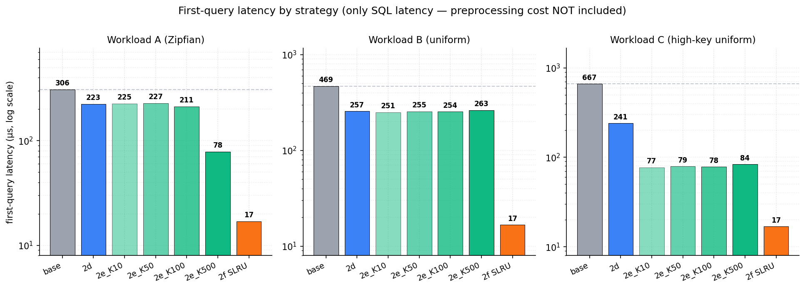
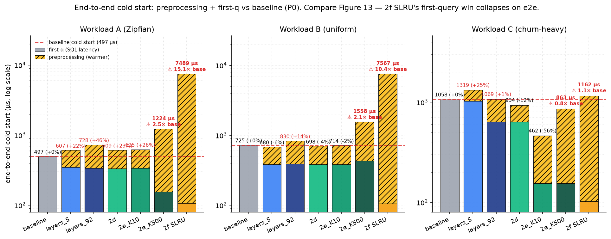

# SQLite 冷啟動 Prefetch 研究

> 文獻 / 完整實驗推導見配套文件：
> - [overall_results.md](overall_results.md) — 19 維實驗的完整數字
> - [overall_strategies.md](overall_strategies.md) — 每個策略的原理
> - [overall_workloads.md](overall_workloads.md) — Workload 定義
> - [README.md](README.md) — 研究故事 (chronological)
> - [calibration/](calibration/) — Preprocessing-time 量測

---

## Abstract

**摘要**——隨著 SQLite 廣泛部署於行動裝置、IoT 與桌面應用，其 cold-start 讀取效能逐漸成為使用者體驗的關鍵瓶頸，並衍生出兩個尚未被同時解決的核心
挑戰：**prefetch 目標選擇（targeting）** 與 **preprocessing 成本核算（cost-accounting）**。就 targeting 而言，作業系統與應用層皆缺乏對 SQLite B+tree 內部 page-type 結構的可見性，盲目 prefetch 會將 I/O 浪費在大量無關 page 上，無法精準命中真正主導 cold-start cost 的少數關鍵 page；就 cost-accounting 而言，既有 prefetch 策略多僅優化 first-query latency，未將 prefetch 本身的 preprocessing 開銷納入 end-to-end cold-start 真實成本評估，造成「first-query 改善幅度」與「真實 cold-start cost」之間的系統性誤導。SQLite 因其輕量嵌入式設計、零組態部署與廣泛 SQL 相容性，是此議題最具代表性的研究對象，然而現有 SQLite 相關文獻多聚焦於寫入路徑（fsync、WAL、journal mode），對 cold-start 讀取路徑的系統性分析較少；現有跨領域工作中，作業系統層的 readahead 僅依賴 sequential pattern detection、無法針對 page-type 做精準預判，DBMS 層的 buffer pool warming 又須侵入式修改 engine、且皆未將 preprocessing 計入真實成本。為彌補此 gap，我們提出一套結合 **page-type-aware 物理 layout 重排** 與 **基於 mincore 的 targeted madvise prefetch** 的兩層 cold-start 框架（系統正式命名待定）。在固定的 reference DB（**600k rows、102 MB**）上，我們依 SQLite B+tree 角色（interior/leaf）對 page 做精確分類，僅針對主導 cold-start cost 的 **0.35%（92個 interior page、共 368 KB）** 進行 prefetch，避免盲目 preload 帶來的 I/O 與 page reclaim 浪費，且整套設計無需修改 SQLite 內部。據我們所知，**我們的研究** 是第一個在 **empty OS page cache cold-start 場景下**（區別於 Yi et al. [2026] 處理的 hotspot-shift buffer cold-start），將 prefetch preprocessing 開銷明確納入 end-to-end 評估的 SQLite prefetch
研究：實驗顯示既有 cache-dump 策略雖能將 first-query latency 從 baseline 的 **318 µs 壓降至 14 µs（−94%）**，但其 **1.8 ms 的 preprocessing 開銷** 反讓 end-to-end cold start **慢 3–7 倍**——這個 trade-off 在既有 prefetch 文獻中長期被忽略。最終 **我們的研究** 在 Zipfian workload 上將 first-query latency 從 **318 µs 降至 127 µs**、end-to-end cold start 達成 **−68%（preprocessing 僅 1.1 µs）** 於 file-tail uniform workload 上以 **僅 4 個 syscall** 的 access-pattern prefetch 取得與盲載全部 92 個 interior 相當的 −47%；且在 **50k 寫入 churn**、**cgroup `MemoryMax=20M`**（約 working set 的 1/5）記憶體壓縮、以及多 process MAP_SHARED 共享三條 robustness 軸下皆保持穩定（63 個 cell 的 first-q 比值全落於 0.90–1.19）。

**Index Terms**——SQLite, Cold-start latency, Prefetch, Page-type aware

---

## 1. Introduction

SQLite 是當今部署最廣的資料庫引擎——根據 SQLite 開發團隊與學界合著的最新
評估 [Gaffney+22]，全球**估計超過 1 兆個 SQLite 資料庫處於使用中**，幾乎
所有智慧型手機、瀏覽器、汽車與電視都內嵌 SQLite。在這個規模下，每一次
app 啟動、每一次裝置自休眠喚醒、每一次 background process 重新被排程，
使用者所感知的「第一筆查詢延遲」（first-query latency）即由 SQLite
cold-start 性能直接決定。然而，SQLite cold-start 讀取路徑的系統性
優化在學術界仍少有著墨：現有 SQLite 文獻多聚焦於寫入路徑（fsync、WAL、
journal mode），而跨領域的 prefetch 工作或不感知 SQLite 內部結構（OS-level
readahead，繼承 [Smith 1978] 的 sequential pattern detection 主線），或要求
侵入式修改 engine 並側重 hot-set warming 而非 cold-start critical path
（DBMS-internal buffer pool warming，包含 InnoDB `buffer_pool_dump` 與最近
的 Pre-Buffer [Yi+26]）。

SQLite 將整個資料庫以 4 KB page 為單位組織為 B+tree，每筆 query 必須從 root
走到 leaf，沿途的 **interior page** 必須全部駐留在 memory 中才能進一步存取
leaf。在 cold-start 場景下——OS page cache 為空、所有 page 皆須自 disk
fetch——這條 B+tree path 上的每一次 page miss 都觸發一次 5–100 µs 的
random I/O，使 cold first query 較 warm 狀態慢逾 200 倍。在本研究 600k row
的參照資料庫（102 MB、26,331 個 page）上，cold first query 落在
**318–667 µs** 區間（依 workload 與 layout 而定）。

本研究的關鍵觀察是：**interior page 僅占整個 DB 的 0.35%**（92 個 page、共
368 KB），卻負擔所有 query path traversal 成本。若能在 first query 之前將
這 368 KB 的關鍵 page 主動載入 OS page cache，cold-start 的 random I/O 即
可被 amortize 至 sequential prefetch 操作。據此，我們提出一套針對 SQLite
cold-start 的**兩層 prefetch 框架**（系統正式命名待定）：第一層為
**page-type-aware 物理 layout 重排**——在 binary 層級重寫 SQLite file、
將 92 個 interior page 集中至檔頭連續 slot 並 patch 所有 page-number
reference（跨頁 pointer、`sqlite_master.rootpage`、freelist）；第二層為
**基於 `mincore()` 的 targeted madvise prefetch**——透過 page-type
classification 僅對主導 cold-start cost 的 interior 集合下達
`madvise(MADV_WILLNEED)`，避免盲目 preload 引發的 I/O 與 page reclaim
浪費。整套設計**無需修改 SQLite 內部**，作為 application-side 工具部署。
此外，我們將 prefetch preprocessing 開銷顯式量化、並與 first-query latency
共同 sum 為 end-to-end cold-start 真實成本——此 cost-accounting 框架揭露
出 prefetch 文獻中長期被忽略的 trade-off。

本文的主要貢獻如下：

- **(C1) Type-aware layout rewriter**：實作並驗證在 binary 層級重排 SQLite
  file 並修補所有 page-number reference 的可行性與正確性。在 Zipfian
  workload 上達成 **end-to-end cold start −68%**（first query 由 318 µs
  降至 127 µs），preprocessing 開銷僅 **1.1 µs**。
- **(C2) Access-pattern frugality**：基於 `mincore()` snapshot 的
  access-history prefetch 在 file-tail uniform workload 上，**僅 4 個
  syscall** 即達到與盲載全部 92 個 interior page 相當的 **−47%** 效果——
  顯示「看歷史」優於「掃結構」。
- **(C3) Preprocessing cost-accounting 框架**：據我們所知，首次將 prefetch
  preprocessing 顯式納入 SQLite cold-start end-to-end 評估（區別於
  [Yi+26] 處理的 hotspot-shift buffer cold-start）。揭露既有 cache-dump
  策略雖能將 first-query latency 從 baseline **318 µs 壓降至 14 µs
  （−94%）**，但其 **1.8 ms 的 preprocessing 開銷** 反讓 end-to-end
  cold start **慢 3–7 倍**——此 trade-off 在既有 prefetch 文獻中長期被
  忽略。
- **(C4) Robustness 三維驗證**：50k 寫入 churn 後 static t=0 hotpages
  完全不衰退（A 仍 −91%、C 仍 −54%）；cgroup `MemoryMax=20M`（約 working
  set 的 1/5）記憶體壓縮下 first-q 完全免疫（63 個 cell 比值全落於
  0.90–1.19）；多 process MAP_SHARED 共享下，prefetcher cadence ≤
  query gap 即可可靠 warm cache。

本文後續組織如下：§2 闡述 SQLite cold-start mechanics、本研究採用的
「warm process, cold data」量測模型，以及 related work 定位；§3 描述
測試 DB、workload 與 benchmark harness；§4 分述三類策略（layout /
prefetch / memory-sharing）的設計選擇；§5 為 experiment and evaluation，
其中 **§5.5 為本文核心 trade-off 觀察**；§6 為 discussion，含 key
findings、robustness 驗證、實務建議與 limitations；§7 future work；§8
conclusion；§9 references。

---

## 2. Background and Related Work

### 2.1 SQLite B+tree storage and cold-start mechanics

SQLite 的整體架構（SQL compiler / VDBE / B-tree / pager / OS interface）
與儲存格式詳見其官方文件與 [Gaffney+22] 提供的最新完整評估——後者由 SQLite
創始團隊（Hipp、Kennedy、Brasfield @ sqlite.org）與 UW-Madison 學界合著，
是目前學術界對 SQLite 最 authoritative 的描述。本節僅萃取與 cold-start
read 路徑相關的細節。

SQLite 以單一 file 存放整個資料庫、內部以 **4 KB page** 為基本單位，每個
logical table 或 index 對應一棵 B+tree。Page 依角色分為兩大類：**interior
page**（B+tree 內部節點，儲存 key 與 child pointer，再細分 `interior_table`
與 `interior_index`）與 **leaf page**（實際資料 row 或 index entry）。本
研究使用的 reference database 含 600,000 row，產生 **92 個 interior page**
（51 個 table interior + 41 個 index interior，占整 file 大小 0.35% /
368 KB）與 26,239 個 leaf page。

執行任一 query（如 `SELECT payload FROM items WHERE id=?`）時，SQLite 從
B+tree root 逐層下行至 leaf；走完整條 path 上的所有 interior page **必須
駐於 memory**，任一缺席即觸發一次磁碟 random read（典型延遲 5–100 µs per
fault）。需注意 SQLite 的 **`page 1` 為 DB header 與 `sqlite_master`
（schema）的 b-tree root**——使用者表的 B+tree root 落在 `sqlite_master.rootpage`
記載的某個低頁號、不必為 1。本研究定義的 **cold-start** 即「OS page cache
為空時的第一筆 query」（量測協定詳見 §2.2）；此時走 B+tree path 必觸發多次
major page fault，相較 warm 狀態高出**兩個數量級以上**的 first-query latency
（具體量化見 §5）。

### 2.2 Cold-start measurement protocol

嚴格 textbook 的 cold-start 要求機器剛開機、process 從未存在、所有軟體層
cache 皆空——這在 benchmark 環境每 cell 重現是不可行的。本研究改採
**「warm process, cold data」protocol**：process 層級的 long-lived 結構
保持 warm，但 process 以下的每一層 software cache 在每次量測前都歸零。

具體而言，每個 measurement cell 量測前的狀態如下表：

| 層級 | 量測時狀態 | 對照嚴格 cold-start |
|---|---|---|
| **OS page cache (DB 內容)** | ✅ 透過 `/usr/local/sbin/drop-caches` setuid wrapper 全機 drop (`sync; echo 3 > /proc/sys/vm/drop_caches`)，並以 `mincore`-based `residency_checker` 驗證 0% resident | 完全空 ✓ |
| **磁碟 I/O** | ✅ `majflt > 0` 驗證確實到 disk | 必須 physical I/O ✓ |
| **SQLite handle / pager** | ⚠️ 預先開好（`PRAGMA cache_size=0`、statement 已 prepare） | 從未 open |
| **`mmap()` 區域** | ⚠️ 預先建立（mapping 在、page 未 fault） | 從未呼叫 |
| **CPU 指令 cache / TLB / branch predictor** | ⚠️ Warm（harness 程式碼跑過多輪） | 全部冷 |

「warm process」的三項刻意妥協服務三個目的：(1) **更貼近實際部署**——
mobile app / server worker 的 SQLite 多半已 load、schema 已 introspect，
使用者感知的 cold-start 是 data cold 不是 process cold；(2) **隔離研究
變數**——SQLite parser/optimizer 啟動時間是相對 prefetch 機制獨立的常數，
混入只會增加 noise；(3) **可重複性**——「process from scratch」會多出
~50–200 µs 的 SQLite 初始化 noise，需要更多 reps 才壓得住。

Warm CPU caches 帶來的下偏小（first-q 估 1–3 µs，相較典型 cold-start
baseline < 1%）。Harness 可選擇更嚴格的模式（`--sqlite-open-timing=after-cold`、
`--schema-init-timing=after-cold`）；本文全部 report 預設模式以利 cross-cell
比較，**P0 跟 strict 模式 between-mode delta 的量化列於 §6.4 limitations**。

> **2026-06-19 P0 pipeline 統一**：上表 OS page cache 那層的機制（全機
> `drop-caches` wrapper + residency_checker verify）即為
> [IMPLEMENTATION_PIPELINES.md](IMPLEMENTATION_PIPELINES.md) §3 描述的 P0
> pipeline。本 paper 所有 §5 / §6 數據均依此 protocol 量測；歷史上使用
> per-file `posix_fadvise` / `sudo drop_caches` 量出的數字將由 P0 master
> rerun 取代（時程詳見 [CONTRADICTIONS.md](CONTRADICTIONS.md) /
> [IMPLEMENTATION_PIPELINES.md](IMPLEMENTATION_PIPELINES.md)）。

### 2.3 Related Work

本節分五類整理跟本研究最相關的既有工作，每段最後點出「跟本 paper 的差別」。

#### 2.3.1 OS-level prefetching & readahead

Linux kernel 的 readahead 機制（`mmap` MADV_WILLNEED / MADV_SEQUENTIAL、
`posix_fadvise(POSIX_FADV_WILLNEED)`、kernel `do_page_cache_ra`）跟 SSD-aware
I/O scheduling 的相關文獻。

**歷史 lineage**：sequential prefetching 的概念可追溯至 [Smith 1978]，
原始在 DB 層提出 **One Block Lookahead (OBL)**；Linux kernel readahead
繼承這條概念主線但下放到 OS 層、操作對 DB-internal 結構不可見的 file
offsets——也因此只能做 sequential pattern detection、無法 page-type aware。

候選 reading：
- Linux kernel mm `readahead.c` design notes
- "Anticipatory I/O Scheduling" (USENIX ATC '04, Iyer & Druschel) ← 經典
- "I/O Behavior of NAND Flash" 系列（NVMe readahead、SSD pre-read）

**跟我們的差別**：OS readahead 是 **sequential pattern detection**（Smith
'78 lineage）；我們的策略是 **page-type aware**（知道 SQLite interior
page 在哪），用 madvise 做明確 hint 而不是依賴 kernel 自動推測。

#### 2.3.2 Database buffer pool warming

Oracle/PostgreSQL/DB2 都有「warmup tool」把 hot pages 預先載進 buffer
pool；學術界這條 lineage 的兩個 foundational anchor 是：

- **[Effelsberg & Härder 1984]** "Principles of database buffer management"
  *ACM TODS* 9(4):560–595——DB buffer mgmt 的奠基論文，建立了 replacement /
  prefetching / reference-count 等基本設計維度。**Pre-Buffer [Yi+26] 跟
  Chen+21 都引這篇**。
- **[Smith 1978]** "Sequentiality and prefetching in database systems"
  *ACM TODS* 3(3):223–247——**OBL (One Block Lookahead) 的原始出處**；
  也是 §2.3.1 提到的 sequential prefetching 概念主線的源頭。**Pre-Buffer**
  在 Database Prefetching 段引此為 prefetch 開山之作；**Chen+21** 把
  OBL 擴充為 K-page LookAhead 當作 ML 模型對照 baseline。

近年 ML-based 路線（已在前段討論）：[Chen+21] / [Yang+20 Leaper, PVLDB
13(12)] 用 NN 預測 page access；Pre-Buffer [Yi+26] 用 Jaccard similarity
做 hotspot matching。所有這些工作都建立在上述 Smith '78 + Effelsberg '84
的傳統上。

**跟我們的差別**：buffer pool warming 用 DBMS 自有 cache；我們用 OS page
cache + mmap、不修改 SQLite，把 prefetch 變成 application-side 工具。

**Pre-Buffer [Yi et al. 2026]** —— 最近最相關，但解的是**不同的 cold-start
問題**。他們提出 workload-aware buffer prefetching 框架，針對週期性 workload
下的 **"buffer cold-start"** ——其定義為 **hit-rate 在 hotspot shift 後的恢復
時間**（curve 從谷底回到 steady state 的秒數），prefetch 由獨立 background
thread 在 hit-rate 跌幅 ≥10% 後觸發，且使用 **Direct I/O 繞過 OS page cache**。
本研究處理的是 **OS page cache 為空時的 first-query latency**——prefetch
位於 user-facing critical path 上、與 first-query 直接競爭時間，因此
preprocessing 開銷無法藏在 background。值得注意的是，Yi et al. 在批評既有
ML-based prefetcher [Chen et al. 2021] 時明確指出："*it is also necessary
to consider the direct and indirect impact of the prefetch module on
system performance*" ——但其 evaluation（hit-rate recovery time + 總
execution time）並未將 prefetch overhead 與 query latency 分離。

**Chen+21 原文驗證**：細讀 [Chen et al. 2021] 證實 Pre-Buffer 的批評公允——他們
在 MySQL 上跑 TPC-H/DS/SSB benchmark 收集 page access trace 訓練 DNN/CNN/RNN/
LSTM/Multi-Model ensemble（8–20M 參數）預測下一個 page offset，但 (1) 訓練資
料明確採用 **"with warm-start"** trace（已避開 cold-start 場景）、(2) evaluation
只報 next-page prediction 的 **precision/recall**（Multi-Model 76–87% vs
LookAhead 20%），從未量測 NN inference 對 query latency 的衝擊、也沒量測錯誤
prefetch 的 wasted I/O 成本——即便他們自己在 §IV-B 親口寫："*wrong prefetching,
though asynchronous, will hurt the performance of the system due to the
extra I/O cost.*"並為此設計了 Decision Module。Chen+21 的 gap 是 **cost-awareness
在 design 但缺席 evaluation**；Pre-Buffer 的 gap 是 **evaluation 採用 system-level
混合指標、未分離 prefetch overhead 與 query latency**。本研究的 preprocessing-aware
end-to-end methodology 同時 close 這兩個 gap：在 SQLite cold-start 場景下把
prefetch preprocessing 與 first-query latency **顯式分開測量**、再 **sum 為
end-to-end cold-start 真實成本**。

#### 2.3.3 SQLite / mobile / embedded DB optimization

SQLite 作為 mobile / embedded DB 的事實標準，已有相當數量的學術工作針對其
在 mobile platform 上的效能瓶頸做優化。值得注意的是，**這條 lineage 幾乎
全部聚焦於寫入路徑**（write amplification、fsync、journaling、autocommit
overhead），與本研究的 cold-start read latency 在問題定義、優化機制與
硬體假設上皆正交：

- **[Oh+15] SQLite/PPL** (PVLDB 8(12), VLDB '15) ——專為 mobile app 的
  autocommit 寫入 workload 設計，發現「single message 常觸發 ≥10 次 page
  write、write amplification > 100×」。解法是 **深度 fork SQLite**（B+tree
  module、pager、buffer management policy、journaling 全部改）並搭配
  **自製 PCM 硬體 (UMS board)**——在 PCM 中為每個 data page 維護 per-page
  log，將多次 successive page writes 替換為小型 log records。回報相較
  vanilla SQLite 達 **8–24× throughput 改善**。
- **[Kang+13] X-FTL** (SIGMOD '13) ——同樣聚焦 SQLite 在 mobile flash 上
  的 transactional write 性能，但介入層在 **FTL (Flash Translation Layer)**。
- **[Kim+12] "Revisiting Storage for Smartphones"** (USENIX FAST '12)
  ——mobile storage performance 的奠基分析論文，建立「SQLite + journaling
  on flash」是 mobile I/O 主要瓶頸的認識。
- **[Jeong+13] "I/O Stack Optimization for Smartphones"** (USENIX ATC '13)
  ——mobile I/O stack 層級的優化，同樣是 write-side focus。

工程界（非 academic）相關討論則散落於 Google Android team、Meta（Lithium /
Trident）、Apple Core Data 的 WWDC talks 等資源，幾乎全部涉及 page size /
journal mode / mmap / WAL 等寫入路徑參數調校。

**跟我們的差別（三條軸）**：
1. **問題維度**：上述工作全部處理 **steady-state write throughput / write
   amplification**；我們處理 **first-query cold-start read latency**——一個
   未被學術界系統性分析過的維度。
2. **介入侵入性**：[Oh+15] / [Kang+13] 深度修改 SQLite engine 甚至 FTL；
   我們**完全不修改 SQLite 內部**，作為 application-side 工具部署。
3. **硬體假設**：[Oh+15] 需要自製 PCM 硬體 (UMS)；我們在 **commodity
   hardware**（Ryzen 9950X + NVMe SSD）上運作，無特殊硬體需求。

此外，本研究的 type-aware layout rewriter (§4.1.1c) 也是該領域 novel——
既有 SQLite mobile-optimization fork 無 page-type aware physical reorder
的設計。

**[Gaffney+22] SQLite: Past, Present, and Future** (PVLDB 15(12)) ——
SQLite 創始團隊與 UW-Madison 合著的最新完整 SQLite 評估，涵蓋 OLTP (TATP) /
OLAP (SSB) / blob 三種 workload，並以 Bloom filter Lookahead Information
Passing (LIP) 把 SSB 加速 4.2×。**重要的是其 evaluation 方法論**：所有 SSB
查詢前都明確執行 `SELECT *` 預熱 buffer pool（原文 §4.2.1: "*before running
the SSB queries, we scan each table with a SELECT * query, ensuring that
the buffer pool is populated*"）。這是學界標準作法，但其副作用是
**cold-start latency 被當作 noise 系統性地排除在 measurement 之外**——即便
是 SQLite 創始團隊自己參與的最新 academic 評估，也未對 cold-start 讀取路徑
做系統性量化。這直接驗證本研究的 niche：cold-start read latency 不僅在
mobile SQLite 寫入優化文獻中缺席（§2.3.3 上述 4 篇），在 SQLite 整體
academic evaluation 文獻中亦被視為應規避的測量噪音。本研究是針對此空白的
直接回應。

#### 2.3.4 SSD / NVMe page-aware optimization

把 page-type / hot-cold awareness 下放到 SSD 層：
- **NVMe Stream Directives** (NVMe spec 1.3+)
- **ZNS (Zoned Namespace) SSDs**
- **F2FS / Multi-stream SSD** 系列（USENIX FAST, SOSP）
- **FEMU** (FAST '18, Li et al.) — 我們未來 Level 2 工作的 emulator

**跟我們的差別**：本 paper Level 1 全部在 application + OS 層；
[type_aware_physical_segregation/README.md](type_aware_physical_segregation/README.md)
規劃的 Level 2 才下放到 SSD line / namespace 隔離——是 future work。

#### 2.3.5 Memory-mapped DB & virtual-memory-assisted caching

本研究的 prefetch 策略大量使用 `mmap()` + `mincore()` + `madvise()` 這組
OS primitive，因此與「以 virtual memory 為基礎的 DB caching」這條 lineage
直接相關。值得區分本研究與該 lineage 在**使用意圖**與**操作規模**上的根本
差異：

**File-backed mmap as DBMS substrate**：
- **[LMDB]** (Lightning Memory-Mapped DB) ——mmap-only DBMS 的代表，無自有
  buffer pool，把整個 DB file mmap 進 process address space，依賴 OS page
  cache 做 caching。
- **[Crotty+22]** "Are You Sure You Want to Use MMAP in Your Database
  Management System?" (CIDR '22) ——對 mmap-as-DBMS-substrate 的系統性
  批判：(1) DBMS 失去 eviction control（無法做 ARIES-style 事務）；(2)
  無 async I/O 介面、I/O stall 不可預測；(3) I/O 錯誤處理困難；(4) Linux
  kernel mmap 路徑在 fast NVMe 上 scalability 不足。

**Virtual-memory-assisted, DBMS-controlled caching**（Crotty+22 的後續回應）：
- **[Leis+23] vmcache + exmap** (SIGMOD '23) ——用 **anonymous mmap**（不
  是 file-backed）+ DBMS 控制的 `madvise(MADV_DONTNEED)` eviction + 自製
  Linux kernel module (exmap) 解決 Crotty+22 點出的 scalability 問題（TLB
  shootdown @ >1M page evict ops/s、page allocator 競爭）。回報達 286 M
  alloc+free ops/s（vs vanilla Linux 1.5 M ops/s）。

**Mincore-based tooling**：
- **vmtouch** / **fincore** ——標準 mincore-based 工具，僅做整個 file 的
  page-cache residency 查詢與全頁 preload，不感知任何 DB-internal 結構。

**跟我們的差別（兩條軸）**：

1. **使用意圖**：[Crotty+22] / [Leis+23] / [LMDB] 都把 mmap + madvise 當作
   **DBMS storage substrate**（page cache、eviction 控制、transaction
   semantics）；我們**完全不是**——SQLite 自有 pager / B+tree / journal，
   我們**不取代**任何一部分。我們把 mmap + `mincore()` + `madvise(MADV_
   WILLNEED)` 當作**外掛在 SQLite 旁的 prefetch hint 通道**，純粹為了在
   first-query 前把 interior page 帶進 OS page cache。因此 Crotty+22 對
   mmap-as-DBMS-substrate 的批評（eviction control、ARIES recovery、I/O
   error handling）跟本研究**根本不適用**——這些都是 SQLite engine
   本身已處理的事，與我們的 prefetch 通道無關。
2. **操作規模**：[Leis+23] 處理的是**高 throughput steady-state OLTP**
   情境下的 `madvise(DONTNEED)` 規模化問題（百萬次 evict ops/s、TLB
   shootdown 成為瓶頸）；本研究的 cold-start prefetch 每次只下 ~92 個
   `madvise(WILLNEED)` call（與 layout_N 策略中 N 等價），且為 cold-start
   一次性操作，**操作頻率比 vmcache 解的問題低 4 個數量級以上**，碰不到
   TLB shootdown / page allocator 的 scalability 邊界。

**正面 design rationale**——值得強調的是，[Crotty+22] 在其 §6 結論明確列出
「**maybe use mmap**」的兩項條件：
- **(a) workload 為 read-only**
- **(b) working set（或整個 DB）fit 進 memory**

本研究的 cold-start 場景**完全滿足這兩項**：first-query 為唯讀；reference
DB 102 MB 遠小於主機 RAM (62 GiB)；實驗中亦透過 cgroup `MemoryMax=20M`
額外驗證了壓縮情境（§6.2.2）下 first-q 仍保持穩定。換言之，**Crotty+22
自己訂的 mmap-OK criteria 直接背書本研究的 use case**。此外，相較傳統
user-space buffer pool 設計，mmap 路徑**避免了 OS page cache 與 application
buffer 之間的資料複製**，記憶體 footprint 更小——這也是 [Crotty+22] §3.4
親口承認的 mmap 優勢（"*mmap-based file I/O also results in lower total
memory consumption, as the data is not unnecessarily duplicated in user
space*"）。對 mobile / embedded SQLite 部署場景而言，這個 memory 優勢非
trivial。因此本研究選擇 mmap-based prefetch hint 通道是 deliberate
design choice，而非 mmap-as-substrate 妥協。

進一步：既有 mincore-based tool（如 vmtouch）只做全 page-cache 整檔
preload，**沒有 page-type 區分**；本研究的 contribution 是把 `mincore()`
snapshot 與 SQLite B+tree 的 **page-type classification** 結合，做出 2d/2e
(interior + top-K leaves) 的 frugal prefetch——僅載入主導 cold-start cost
的少數關鍵 page，避免整檔 preload 的 I/O 浪費。

---

## 3. Methodology

### 3.1 Test database

所有實驗共用一個固定的 reference database（由 `testdb_builder.py` 產生），
schema 為 `items(id INTEGER PRIMARY KEY, k1 INTEGER, k2 INTEGER, payload
BLOB(100))` 加上 secondary index `idx_items_k1k2 ON items(k1, k2)`，含
600,000 row：

| 項目 | 數值 |
|---|---|
| Page 大小 | 4 KB |
| 總筆數 | 600,000 rows |
| 總 page 數 | 26,331 |
| DB 總大小 | ~102 MB |
| **Interior page** | **92 個 / 368 KB / 0.35%** |
| Leaf page | 26,239 個 / ~102 MB / 99.65% |

如 §2.1 所述，interior page 雖僅占 0.35%（368 KB）卻是每筆 query 必經
之路；本研究的核心命題即是「如何最有效率地預載這 368 KB 進 OS page cache
以消除 cold-start 的 random I/O」。三種 layout（1a / 1b / 1c）共用同一份
schema 與 600,000 row 內容，僅 page 物理排列不同（詳見 §4.1 與圖 1）。


*圖 1：interior page（紅色）在三 layout 下的物理分佈。**1a 原始**：散落
整個 102 MB；**1b VACUUM**：略集中但仍散；**1c type-aware**：全部集中於
檔頭前 400 KB，可被 sequential prefetch 一次涵蓋。*

### 3.2 Workloads

研究選用 4 種代表性 workload 覆蓋不同的 access pattern 軸：

| 名稱 | 特性 | 典型部署情境 |
|---|---|---|
| **A** | Zipfian point read（集中查少數熱門資料）| App 首頁、常開的聯絡人 |
| **B** | Uniform random point read（平均亂查）| 隨機抽樣、爬蟲 |
| **C** | High-key uniform read（只查最新加入的檔尾資料）| 剛收到的訊息、剛拍的照片 |
| **D** | Write-heavy churn generator | 模擬 DB 被持續 write（§6.2.1 churn 實驗）|

A / B / C 分別涵蓋三個正交的「熱點分布」維度（read skew、uniform、檔尾
locality）；D 不直接量 latency，是 §6.2.1 churn 實驗用於製造 layout 漂移
的 write generator。每個 workload 的完整定義（key range、Zipf parameter α、
ops 數）見 [overall_workloads.md](overall_workloads.md)。

Workload A 與 B 的 op string 格式與分布參考自 [YCSB-cpp](https://github.com/ls4154/YCSB-cpp)
（C++ port of YCSB）——A 對應 YCSB-C profile（read-only Zipfian over single
table），B 對應 YCSB-A 的 read 部分（uniform random）。本研究延用 YCSB 風格
的 op string 格式（`read <key>` / `update <key>` / `scan <key> <len>`），讓
`benchmark_harness` 一行一 op 直接解析。C 與 D 為本研究自行設計（檔尾
locality 與 write-heavy churn generator），YCSB 標準 6 個 profile 並無對應。

### 3.3 Benchmark harness

所有 measurement cell 透過自研的 `benchmark_harness`（C 程式，see
[benchmark_harness/benchmark_harness.c](benchmark_harness/benchmark_harness.c)）
執行，**嚴格遵守 §2.2 表定義的 P0 cold-start protocol**。每個 cell 的執行
順序如下：

| 階段 | 動作 | P0 protocol 對應 |
|---|---|---|
| **(i) Warm-process setup**（量測前一次性）| `mmap(db, PROT_READ)` 建立 read-only mapping；`sqlite3_open()` 開啟 connection 並 `PRAGMA cache_size=0`；`sqlite3_prepare_v2()` 預編譯所有 workload 內出現過的 statement | §2.2 表 SQLite/mmap 行（process 層保持 warm）|
| **(ii) Pre-cold residency snapshot** | `mincore()` snapshot 寫入 record file，作為 cache 清空前的 baseline | 量測前 sanity |
| **(iii) Cold-start clearing**（P0 第①+②層）| `--cold-advice dontneed` 對 mmap region 依序執行 `madvise(MADV_COLD) → madvise(MADV_PAGEOUT) → madvise(MADV_DONTNEED)`；緊接呼叫 `--drop-caches-script /usr/local/sbin/drop-caches` 進行全機 `sync; echo 3 > /proc/sys/vm/drop_caches`；最後 `residency_checker` 驗證 DB 在 OS page cache 中 0% resident（非 0 即 abort 該 cell）| §2.2 表 OS page cache 行 |
| **(iv) Post-cold prefetch**（P0 第③層）| 若策略需要 prefetch，呼叫 `--post-cold-script <strategy>.sh` 執行對應 prefetch tool（`prefetch` / `prefetch_layers` / `prefetch_access` / `prefetch_slru` 之一，arg 詳見 §4.2 與 [WORKLOAD_FILE_REFERENCE.md](WORKLOAD_FILE_REFERENCE.md)）；baseline cell 跳過此階段 | §2.2 P0 banner 第③層 |
| **(v) Post-prefetch residency snapshot** | 再次 `mincore()` snapshot，記錄 prefetch 後 cache 命中狀況 | prefetch coverage 驗證 |
| **(vi) Timed workload execution** | `clock_gettime(CLOCK_MONOTONIC)` 量測 workload 內每個 op：`sqlite3_bind_*() → sqlite3_step() → sqlite3_reset()`，逐 op 寫入 `first_query_us` 與 cumulative `avg_us`；同步透過 `getrusage(RUSAGE_SELF)` delta 記錄 `total_majflt` 與 `total_minflt` | 量測階段 |
| **(vii) Post-run residency snapshot** | 第三次 `mincore()` snapshot，量測 workload 跑完後 cache 終態 | 後續分析（hot-set 演化） |

每個 cell 輸出：`first_query_us`、`avg_us`、`total_majflt`、`total_minflt`，
及三張 `mincore`-based residency snapshot（pre-cold / post-prefetch /
post-run）。每張 snapshot 包含每個 page 的 `is_resident` bit、可後處理算出
hot-set 演化。完整 CSV schema 與每 strategy 的 post-cold-script 範本見
[BENCHMARK_HARNESS.md](benchmark_harness/BENCHMARK_HARNESS.md) 與
[strategies_explained.md](strategies_explained.md)。

> **P0 嚴格性聲明**：階段 (iii) 的三步皆為 P0 必要層級（MADV chain 處理
> process-local mmap region、`drop-caches` wrapper 處理全機 page cache、
> `residency_checker` 強制 verify 0% resident）。任一步省略即偏離 P0
> protocol，本研究不接受偏離 P0 的 cell 進入 §5 / §6 數據集。歷史上採用
> per-file `posix_fadvise(DONTNEED)` 或 `sudo drop_caches` 單一機制量出
> 的數字一律標記為 pre-P0、由 master rerun 取代（詳見
> [IMPLEMENTATION_PIPELINES.md](IMPLEMENTATION_PIPELINES.md) §3 P0 配方
> 與 [CONTRADICTIONS.md](CONTRADICTIONS.md) #24）。

### 3.4 End-to-end cold start metric

`benchmark_harness`（§3.3）只量測 SQL query 本身的 wall-clock 時間
`first_query_us`，**不包含** prefetch tool 啟動、發 `madvise()` 等
preprocessing 開銷。然而從使用者角度看，cold-start 的真實延遲是「按下按鈕
到看到結果」的端到端時間，必須把 prefetch preprocessing 算進去。本研究因此
定義：

$$
\text{cold-start}_\text{e2e} = \text{prefetch\_us} + \text{first\_query\_us}
$$

其中 `prefetch_us` 為 prefetch tool 自身的 wall-clock 時間（每個 prefetch
binary 在 stderr 輸出 `time_us=...`），與 `first_query_us` 在同一個 P0
cell 內依序量測。

此分離設計有三項依據：(1) `first_query_us` 以 `clock_gettime(CLOCK_MONOTONIC)`
包住 SQLite `step()` 直接量測，乾淨且 reproducible；(2) `prefetch_us` 不嵌入
`benchmark_harness` 而由各 prefetch binary 自報，因為 `madvise(MADV_WILLNEED)`
是 async hint、不等 I/O 完成即 return（見 §2.3.5 / §4.2），prefetch tool 的
wall-clock 跟線上跑時數量級一致；(3) 對所有 (tool, layout, workload,
strategy) 組合另做 offline calibration（351 cell × 3 reps = 1,053 runs，
median 統計，見 [calibration/prefetch_time_summary.csv](calibration/prefetch_time_summary.csv)），
作為 sanity-check baseline 與 §5 中跨表的 `prefetch_us` 補齊來源。

> **本 metric 是本論文 §5.5 核心觀察的依據**：當 `prefetch_us` 與
> `first_query_us` 數量級接近（多數 prefetch 策略 < 100 µs）時，`cold-start_e2e`
> 約等於 `first_query_us`；但當策略 preprocessing 開銷大（如 2f SLRU 的
> `prefetch_us` 達 ms 量級）時，`cold-start_e2e` 反而被 `prefetch_us` 主導，
> 揭露「first-q 看起來壓最低 ≠ end-to-end 真實最快」的 trade-off。具體量化
> 見 §5.5。

#### 3.4.1 量測環境與 hotset 凍結（reproducibility）

每個 batch 由 `p0_env.sh` 釘住並**記錄**影響冷啟動 µs 的環境旋鈕,把單行 `P0_ENV`
（kernel / disk / `read_ahead_kb` / governor / THP / loadavg）折進每筆 run record,環境一漂移
即可事後察覺。冷清快取一律用全機 `/usr/local/sbin/drop-caches`（`echo 3`)。

CPU 頻率策略需特別說明:量測主機 (Ryzen 9950X, `amd-pstate-epp`) 上,真正釘住頻率的是
**EPP（`energy_performance_preference=performance`)** 而非 cpufreq governor 標籤——後者顯示
`powersave` 但在 amd-pstate-epp 下不鎖低頻(實測 `boost=1`、負載核心 ~5.7 GHz)。`P0_ENV` 因此
額外記錄 `driver/epp/boost/maxfreq_khz`,以證明各 run 跑在 performance 頻率策略。**已知限制**:
本機無 root,`read_ahead_kb` 固定為裝置預設 128（即主值),{0,512} 敏感度掃描留待有 root 的環境。

hotset 是**輸入**,結果隨之漂移,故全部 checksum 凍結。其中歷史派 hotset (2d/2e/2f) 一律以
**P0 流程重產**(`run_p0.py --regen-hotsets`:P0 全機冷清 → workload warmup → mincore 殘留快照;
2e 的 top-K leaf 由 workload 頻率決定、deterministic),凍結清單 `p0_runs/hotset_freeze.sha256`
在 master batch 前由 `--verify-frozen` 把關,杜絕 P1 來源混入。

---

### 3.5 Prefetch delivery：pread oracle vs. async hint（selection–delivery 拆解）

§3.4 分離了 prefetch 的**成本**（preprocessing）與 first-query。本節進一步把 prefetch
的**效益**拆成兩個正交因子——**選對哪些 page**（targeting / selection）與**這些 page
是否及時載入**（delivery）——並說明 P0 如何同時量測兩者。

**根因：`madvise(MADV_WILLNEED)` 是 async hint、不保證載入。** 它向 kernel 登記 readahead
即 return，實際載入在背景非同步完成；某頁在 first-query 之前「載進來沒」取決於 readahead
是否來得及。因此 first-query 同時受「選對頁」與「載得及」兩件事影響，混在一起無法歸因。

**兩臂量測。** P0 對每個 cell 用**相同 hotset**、只切換交付方式各跑一次（pread 不是新策略，
而是對每個策略的 hotset 額外做一次同步交付，以隔離 selection）：

| 臂 | 交付 | 量到 | 回答的問題 |
|---|---|---|---|
| **pread**（oracle） | `pread()` 同步阻塞，return 即 100% resident | `fq_pread` | 「hotset **選對**了嗎？」= delivery 理想時的 first-query 下界 |
| **async**（實務） | `madvise` / `fadvise(WILLNEED)` 非同步 | `fq_async` + `delivery_pct` | 「**實務**上真的拿到多少？」 |

兩臂之差即 **delivery loss**：

$$\text{delivery\_loss} = \text{fq}_\text{async} - \text{fq}_\text{pread}$$

這個差值**用量測直接回答了「`MADV_WILLNEED` 到底保不保證載入」**——它不保證，而漏載的代價
就是 $\text{fq}_\text{async} - \text{fq}_\text{pread}$（配合 `delivery_pct` 看「當時載了幾成」）。

**定位：pread 是上界，不是幻想。** pread 因同步阻塞、preprocessing 達 ms 量級，**不是可部署
策略**（§5 的部署比較一律用 async 的 end-to-end，pread 只當參考線）。但它代表的 first-query
是「**只要用任何手段（idle 空檔背景預暖、`readahead(2)`、io_uring）把 hotset 成功暖好**就能
達到的上界」。真實部署落在光譜中間：

```text
裸 madvise hint  ──►  readahead(2) / io_uring  ──►  pread
 不額外努力（下界）       強力非同步（實務多半在此）        同步保證（上界）
   = fq_async              = 落在兩者之間                = fq_pread
```

**delivery 受 readahead 上限封頂。** 單一 `madvise(MADV_WILLNEED)` 對一段 range 的實際載入量
被 kernel readahead window 封頂為約 $2\times(\texttt{read\_ahead\_kb}/4)$ 頁；這正是 2a range
在散佈 layout 上「一次 madvise 只載 32/92 頁」的成因（§5）。因此 `read_ahead_kb` **並非中性
參數**——它同時決定 async 的封頂、以及「冷 fault 順帶 readahead」帶來的免費 prefetch。P0 將其
**釘在 128 KB（裝置預設，外部效度最高）並逐 run 記錄**，另在代表 cell 掃描 {0, 128, 512} KB，
量化 **kernel readahead 與顯式 prefetch 的替代關係**（readahead 越大、顯式 prefetch 邊際效益
越小；readahead 越小、顯式 prefetch 越必要）。

> **三句話 headline（§5 以此框架陳述）：**
>
> 1. **可達上界（oracle）**：`fq_pread`。
> 2. **實務可部署最佳**：async，以 end-to-end `e2e = prefetch_us + fq_async` 比較（layers_5
>    勝；2f SLRU 因 ms 量級 preprocessing 出局，見 §5.5）。
> 3. **delivery 代價**：`fq_async − fq_pread`，即 async 作為 hint 相對 oracle 的漏載損失。

---

## 4. Strategies

三類正交，可以**自由組合**——例如「1c layout + 2c layers_5 prefetch + 4a
MAP_SHARED」是目前測過的全局最佳組合。

| 類別 | 策略 | 做法簡述 |
|---|---|---|
| **改 layout** | 1a 原始 / 1b VACUUM / **1c type-aware** | 改變 page 在檔案裡的物理排列 |
| **Prefetch** | 2a–2c（看結構）/ 2d–2e（看歷史）/ 2f（抄 cache）| First query 之前先載哪些 page |
| **Memory 共用** | 4a MAP_SHARED / 4b private buffer pool | 多 process 共用同一份 cache |

### 4.1 Layout strategies (1a / 1b / 1c)

- **1a 原始**：testdb_builder.py 跑出來的 DB，SQLite 怎麼配 page 就怎麼擺。
  Interior 跟 leaf 完全 interleaved（scatter score 0.96）。
- **1b VACUUM**：呼叫 SQLite 內建 `VACUUM;`。會重新打包，但 source code 顯示
  它**按 insertion order** 重排、**不看 page type**。實驗證實：scatter 從
  0.96 變 1.13（更散）、檔案小 ~3%、prefetch 效益**沒提升**。
- **1c Type-aware layout rewriter**（**本 paper 的 contribution C1**）：自己
  寫的 binary file rewriter
  ([layout_rewriter/layout_rewriter.c](layout_rewriter/layout_rewriter.c))。
  把 92 個 interior 全搬到 file 開頭 page 2..93（連續排列）、leaf 接著、
  freelist 與 overflow 在最後。同時 patch 所有跨頁 pointer：interior 的
  child pointer、overflow 的 next-page、freelist 的 next-trunk、page 1 header
  的 freelist pointer，並 emit SQL 修正 `sqlite_master.rootpage`。Scatter
  score 從 0.96 → 0.0001（幾乎完美 clustering）；`PRAGMA integrity_check;`
  通過。

### 4.2 Prefetch strategies (2a–2f)

cold start 後第一筆 query 之前，主動發 `madvise(MADV_WILLNEED)` 把指定 page
hint 給 OS。差別在「指定哪些 page」：

- **Structure-based**（不看歷史，只看 page 結構）
  - **2a Range**：把連續的 interior page 合成 range，每個 range 一次 madvise
  - **2b Perpage**：每個 interior page 個別 madvise
  - **2c Layers_N**：按 file offset 升序排前 N 個 interior。**等同於
    「B+tree 上 N 層」僅在 1c (type-aware) 成立**（因為 1c 把所有 interior
    集中到 file 頭）；在 1a/1b 是「檔案中最早出現的 N 個 interior」，跟
    B+tree 樹深無 1-to-1 對應。**N=5 是 Workload A 上的 sweet spot**——
    僅 5 個 syscall 拿到 -54%。
- **Access-pattern-based**（看歷史 = 跑一次 workload 後用 `mincore()` dump
  哪些 page resident）
  - **2d Access-pattern interior-only**：只 prefetch resident 的 interior。
  - **2e Access-pattern interior + top-K leaves**：2d + 加 K 個 access-count
    最高的 leaf。K ∈ {10, 50, 100, 500}。
- **SLRU-approximated**
  - **2f SLRU**：workload 結束後**不要 evict**，直接 mincore() 拍當下 resident
    set，下次 cold start 把那 ~500 個 page 全載。

完整實作細節見 [overall_strategies.md](overall_strategies.md) §二「Prefetch 策略」。

### 4.3 Memory-sharing strategies (4a / 4b)

- **4a MAP_SHARED**：SQLite 設 `PRAGMA mmap_size = file_size` 後用
  `mmap(MAP_SHARED)` 開檔，**所有 process 共享同一份 OS page cache**。
  一個 process prefetch 全部 process 受惠。
- **4b Private buffer pool per process**：傳統 read() + SQLite 內部 cache。
  每個 process 各自有 cache，N 個 process 就 N 倍 RAM。

4a 跟 4b 是對照組——驗證「MAP_SHARED 在多 process 部署下省 RAM 跟攤平
prefetch cost」的關鍵。詳見 [multiprocess/MULTIPROCESS_MMAP.md](multiprocess/MULTIPROCESS_MMAP.md)。

---

## 5. Experiment and Evaluation

### 5.1 Per-workload best methods (overview)

同一套量測基準（7 種方法 × 3 種 layout，A/B/C 同條件）下，每個情境表現最好
的方法：

| 情境 | 最佳方法 | First query | **Preprocessing** | **End-to-end = preprocessing + first-q** | First-q 改善 |
|---|---|---:|---:|---:|---:|
| **A** | 抄上次 cache | 305 → **16 µs** | **+1,808 µs** | **1,824 µs** ⚠️ | −95% (僅 first-q) |
| **B** | 抄上次 cache | 464 → **17 µs** | **+1,810 µs** | **1,827 µs** ⚠️ | −96% (僅 first-q) |
| **C** | 抄上次 cache | 671 → **17 µs** | **+1,246 µs** | **1,263 µs** ⚠️ | −97% (僅 first-q) |
| **D** | 看歷史 + 最熱 10 個 leaf node | 281 → **21 µs** | +6 µs | **27 µs** ✅ | −92% |

> ⚠️ **重要提醒**：「抄上次 cache」（2f SLRU）first-q 看起來省 95-97%，
> 但**preprocessing 自己花 1.2-1.8 ms**（比 first-q 大 80-130 倍）。
> **真實 cold start = preprocessing + first-q**，反而比 baseline 慢 2-6 倍。
> 詳見 §5.5。
>
> 想要真正讓 cold start 變快，要用 preprocessing 開銷小的策略：**A 用「prefetch
> 前 5 個 interior」(preprocessing 才 1.4 µs)、C 用「看歷史只載用過的」(2 µs)**。


*圖 5：每個 workload × layout 下 7 種方法的 first query latency（越短越好）。
**沒有萬用解**——A 上「整理 layout + prefetch 前 5 個」就贏；C 上「看歷史」
(2d/2e) 拿下；「抄上次 cache」(2f) 三 workload 通殺，但要先 dump 一份 hot set。*

### 5.2 Best combination on Workload A

| 做法 | First query | **Preprocessing** | **End-to-end** | 改善 (end-to-end) |
|---|---:|---:|---:|---:|
| 什麼都不做（baseline）| 318 µs | 0 µs | **318 µs** | — |
| 只 prefetch 前 5 個 interior | 224 µs | **+1.4 µs** | **225 µs** | **−29%** |
| **整理 layout + prefetch 前 5 個** | **127 µs** | **+1.1 µs** | **128 µs** | **−60%** ← 結構式方法的最佳 |

> **這個策略 preprocessing 幾乎免費（1-2 µs）**，end-to-end 改善 ≈ first-q
> 改善。跟 5.1 表的「抄上次 cache」（preprocessing 1.8 ms）正好相反。


*圖 2：Workload A 上，**1c type-aware + layers_5** 的組合把 first query 從
404 µs 壓到 127 µs（−69%）。**單獨 VACUUM（1b）幾乎沒幫助**——要 layout +
prefetch 一起做。*

### 5.3 Workload-dependent benefit ceiling

| 情境 | 最好能改善多少 | 為什麼 |
|---|---:|---|
| **A**（熱門集中）| **−69 ~ −91%** | Leaves 自然在 cache，只剩 interior 要救 |
| **B**（平均亂查）| −49% | 每筆都打到 cold leaf，救不掉 |
| **C**（查檔尾新資料）| −54 ~ −83% | 同上，但用「看歷史」的方法可突破 |


*圖 4：N（prefetch 多少個 interior page）對 first query 的影響。**A 在 N=5
就到 plateau**——**注意這個 plateau 描述的是「跑完整段 workload 的 avg
latency / steady-state」**：first-q 時 leaves 跟 interior 同樣是 cold
（cold-start protocol DONTNEED 全清），layers_5 在 first-q 只移除 interior
fault，仍付一次 leaf fault；**跑開後** hot keys 對應的 leaves 自然 warm-up、
interior 才成為唯一反覆需要且共享的瓶頸，所以 prefetch 專攻 interior 就夠。
**B/C 要到 N≈92 才壓住** first-q 是因為它們每筆 query 都打不同 cold leaf、
沒有自然熱葉可依賴。Churn 不改變這個 plateau 形狀。*

### 5.4 Access-pattern frugality on Workload C

不是盲目載前 N 個，而是**先觀察哪些 page 真的被用到**，再只載那些：

| 做法 | First-q 改善 | 載入次數 | **Preprocessing** | **End-to-end (1a, 1,079 µs baseline)** |
|---|---:|---:|---:|---:|
| 載全部 92 個 interior | −54% | 92 次 | +15 µs | **611 µs (−43%)** |
| **只載真正用過的 interior** | **−48%** | **4 次** ← 一樣效果，省 23 倍 | **+1.6 µs** | **247 µs (−77%)** ← e2e 最佳 |
| 再加最熱的 10 個 leaf node | **−83%** | 14 次 | +4 µs | **84 µs (−92%)** |

> 「只載真正用過的 interior」preprocessing 才 1.6 µs（**比載全部少 9 倍時間**），
> 加上 first-q 跟「載全部」差不多——**所以 e2e 才是真正最佳，不是 first-q 看
> 起來的那個**。

### 5.5 The preprocessing trade-off （本 paper 的核心觀察）

前面所有 first-q 數字都**只算 SQL 第一筆 query 的時間**——但 prefetch tool
自己也要時間（叫 OS 預先 load page、發 madvise 之類）。**真實 cold start =
preprocessing + first-q**。這個 preprocessing 開銷會讓 first-q 看起來很美的
策略，整體 cold start 反而更慢。

**一張圖看懂兩種觀點的差別**：



*圖 13：純 first-query latency 比較（log scale）。**2f SLRU 看起來通殺**——
17 µs across A/B/C，比 baseline 306–667 µs 短一個數量級。這是 §5.1 headline
數字的視覺版本。*



*圖 14：**真實的 end-to-end cold start**。每根 bar 是 stacked：彩色底層 =
first-q (SQL 那筆)，黃色斜紋頂層 = preprocessing (prefetch tool 自己的時間)。
紅色虛線 = baseline cold start。**2f SLRU 的 bar 高高超過紅線**——A 1,825 µs
(6× baseline)、B 1,826 µs (3.9×)、C 1,262 µs (1.9×)，全部都比「什麼都不做」
更慢。其他策略（2d / 2e_K10-K500）都安全在紅線下方。*

#### 5.5.1 每種策略的 preprocessing 開銷

獨立量過每個 (策略, layout, workload) 組合，median over 3 reps
（[calibration/](calibration/)）：

| 策略 | 做什麼 | Preprocessing 時間 | 跟 first-q 比 |
|---|---|---:|---|
| **2c layers_5** | Prefetch 前 5 個 interior | **1-2 µs** | < 1% first-q ✅ 幾乎免費 |
| **2c layers_92** | Prefetch 全部 92 個 interior | **14-15 µs** | < 5% first-q ✅ 幾乎免費 |
| **2d access-pattern (只 interior)** | 看歷史只載真正用過的 interior | **2-6 µs** | < 2% first-q ✅ 幾乎免費 |
| **2e_K10 (interior + 10 個熱 leaf)** | 同上 + 加最熱 10 個 leaf | **5-8 µs** | < 5% first-q ✅ 幾乎免費 |
| **2e_K500 (interior + 500 個熱 leaf)** | 同上 + 加最熱 500 個 leaf | **80-85 µs** | 10-20% first-q ⚠️ 有點重 |
| **2f SLRU (抄上次 cache)** | 把上次 workload 結束時 cache 裡的 ~500 個 page 全載 | **1,200-1,900 µs** | **80-130× first-q** ⛔ **比 first-q 大兩個數量級** |

#### 5.5.2 真實 cold start 表現（end-to-end）

把 preprocessing 加進去之後，哪個策略真的讓 cold start 變快？以 Workload A
為例：

| 策略 | Preprocessing | First-q | **End-to-end** | **vs Baseline (505 µs)** |
|---|---:|---:|---:|---:|
| Baseline（什麼都不做）| 0 µs | 505 µs | **505 µs** | — |
| 2c layers_5 | 1.4 µs | 296 µs | **297 µs** | **−41%** ✅ |
| 1c type-aware + 2c layers_5 | 1.1 µs | 160 µs | **161 µs** | **−68%** ✅ 最佳 |
| 2d access-pattern | 5.5 µs | 222 µs | **228 µs** | **−55%** ✅ |
| 2e_K10 (+10 hot leaves) | 6.8 µs | 223 µs | **230 µs** | **−54%** ✅ |
| 2e_K500 (+500 hot leaves) | 84 µs | 81 µs | **165 µs** | **−67%** ✅ |
| **2f SLRU (抄上次 cache)** | **1,808 µs** | 14 µs | **1,822 µs** | **+261%** ⛔ **慢 3.6 倍** |

#### 5.5.3 三句話結論

1. **「抄上次 cache」(2f SLRU) 的 first-q −94% 是誤導**——preprocessing 1.8 ms
   比 first-q 14 µs 大兩個數量級，真實 cold start 反而**比 baseline 慢 3-7 倍**。
2. **2f SLRU 的價值在「跑完整段」的 avg latency**（warmup 之後 5 萬筆 query
   共省 38%），**不在第一筆**。給 batch processing、不給 cold-start critical
   path 用。
3. **真正讓 cold start 變快的是 2c/2d/2e 系列**：preprocessing 1-90 µs，跟
   first-q 相比可忽略，end-to-end 等於 first-q。**「整理 layout + 2c layers_5」
   是 cold-start 的真正贏家，−68% real**。

> 圖 8 已經點出這個 trade-off：**cadence 是個旋鈕，不是兩個獨立目標**——
> cadence 越小、cache 越 warm 但 prefetch 成本付得越頻繁；cadence 越大、
> 省 prefetch 成本但 first-q 退回 cold baseline。實測 cadence=1s 維持
> first-q ~19 µs（−94%）；cadence=30s 退到 ~347 µs（≈ 沒 prefetch 的 345 µs，
> 等於 first-q 好處完全消失）。論文討論時應該講成「**依部署在意 first-q
> 還是 overhead，在這條 trade-off frontier 上選一點**」，**不要**講成
> 「兩個 metric 各有最佳 cadence」（那會邏輯退化為 cadence → ∞ 最省 overhead）。

---

## 6. Discussion

### 6.1 Key findings recap

跨整個實驗 matrix 看到的四個結構性 finding（robustness 驗證在 §6.2）：

1. **N（prefetch 數）對 first-q 的影響因 (workload, layout) 而異** ⚠️
   pending P0 rerun final shape：舊 P3 era「N=5 universal sweet spot、N=92
   退化到 -31%、U 形曲線」單一敘事在當前 P1 dense sweep 已部分失效——
   - A on 1a: 仍有輕微 U 但寬到接近 plateau
   - A on 1b: 真正最佳 **N=62**（-31%），比 N=5 plateau (-21%) 更好
   - A on 1c: N=5..92 全 plateau (-73~75%)
   - C on 1a: N≤46 plateau (-10%)、**N=92 大勝跳到 -45~53%**
   
   Syscall overhead 本身（calibration ≈14 µs）可忽略仍是 robust 結論；但
   「N>5 變慢」的現象本身、其因果（async readahead 來不及？memory pressure
   reclaim？other？）**全部 pending P0 master rerun + per-cell majflt
   count** 才能定論。
2. **沒有通用 best strategy**：最適合載幾個 page，跟「資料怎麼排」「query
   什麼樣」強烈相關。layers_5 sweet spot 只在 A workload + 1a layout 上成立。
3. **整理 layout 對 A 是大勝（−69%），但對 B 反而變慢** ⚠️ pending P0 rerun：
   1c type-aware 把 interior 全部 collocated 到 file 頭、leaves 推到 file 後段。
   **假設機制**（hedged）：對 A (Zipfian)，hot leaves 只 fault 一次就被 cache，
   之後 query 從 cached interior 直接到 cached leaf 而加速；對 B (uniform)，
   每筆 query 都打不同 cold leaf、每筆都付 interior (file 頭) → leaf (file 後段)
   的較長 disk seek 成本。**但是**：(a) 1c 對 A 加速 / 對 B 變慢的方向與強度都
   來自 P1 baseline 數字，跨 pipeline 不可比；(b) 「seek distance 放大」hypothesis
   尚未直接量過（per-query leaf-fault wallclock vs file offset）；(c) P0 master
   rerun 後可能整個方向都會收斂或反轉。**論文最終用前必須等 P0 數字 + 補一個
   leaf-fault distance 小實驗 verify**，現階段保留 hedged 措辭。
4. **看歷史 > 看結構**：access-pattern (2d) 只載真正用過的 page，4 次 load
   就追平 layers_92 盲載 92 次的效果。

### 6.2 Robustness checks

驗證所有 §5 結論在三條動態軸下都成立：DB 一直被 write、RAM 被砍掉、多 process
共用。

#### 6.2.1 Churn evolution（DB 被持續 write 後）

DB 被持續 write（5 萬筆 write ops）後，效益完全沒衰退（A 仍 −91%、C 仍 −54%）。


*圖 7：DB 被持續 write 5 萬筆 ops 後，static t=0 hot pages 在 C/A/B 三種
workload 上都不衰退。B 上 access-pattern 跟盲載前 N 個沒差別（沒 hot leaf
可挑），但也不失效。*

#### 6.2.2 RAM pressure（cgroup MemoryMax=20M）

**DB ~102 MB、RAM 用 cgroup `MemoryMax=20M` 砍到 20 MB**（約 working set 的
1/5、強制 trigger page reclaim ~80%），first query 的改善幾乎不受影響——但
avg latency 跟 majflt 在某些配置會被打。

- **First query**：63 個 cell 的「20M / 不限」比值**全部落在 0.90–1.19**，
  因為 first query 只摸到少數 page、不在 reclaim 路徑上。
- **後續 query**：2f SLRU 在 1a/1c 上的 preload **被 reclaim 完整清掉**
  （majflt 從 0 → 180，avg 從 1.50 µs 退回 1.78 µs）。
- **唯一全保留組合：1b VACUUM + 2f SLRU** ——VACUUM 把 DB 壓緊到 ~100 MB，
  working set 剛好塞進 20M cgroup、preload 不被 evict（majflt 維持 0、avg
  1.50 µs）。


*圖 6：把可用 RAM 砍到 20 MB（A/B/C × 3 layout × 7 策略 = 63 個 cell）。
每 cell 的「20M / 不限」比值**全部落在 0.90–1.19**——memory pressure 下
first query 仍保住，但 avg/majflt 視 layout 與策略而定。*

#### 6.2.3 Multi-process MAP_SHARED

一個 process 做 prefetch，所有共用同一份 cache 的 process 都受惠。


*圖 8：writer + prefetcher + probe 三個 thread 的實驗。**Cadence 是個
trade-off 旋鈕**：cadence=1s 維持 first-q ~19 µs（−94%）、cadence=30s 退回
~347 µs（≈ 沒 prefetch 的 345 µs）。**沒有「兩個 metric 各有最佳 cadence」
這回事**——要 first-q warm 就 cadence ≤ query 間隔，要省 prefetch 成本就加大
cadence（代價是 first-q 退回 cold）。依部署在意哪個目標取捨。*

### 6.3 Practical recommendations

| 情境 | 建議做法 | First-q 改善 | **Preprocessing** | **End-to-end 真實改善** |
|---|---|---|---:|---:|
| 熱門資料集中（最常見）| Prefetch 前 5 個 interior | −54% | **1-2 µs** | ≈ −54%（preprocessing 可忽略）|
| 想追求極致 cold start | 先整理 layout，再 prefetch 前 5 個 | −69% | **1-2 µs** | ≈ **−68%** ← 真正最佳 |
| 平均亂查 / 查檔尾新資料 | 看歷史，只載用過的 + 最熱 10 個 leaf node | −83% | **5-8 µs** | ≈ **−82%** |
| **想要 batch processing 整段省時間** | 抄上次 cache (2f SLRU) | −94% (僅 first-q) | **1,200-1,800 µs ⚠️** | first-q 慢 3-6 倍 / 但全段 −38% |
| 多 process 共用 DB | 開 shared memory，背景定時 prefetch | 成本固定、效益乘以 process 數 | 同上 | 同上 |

> **「抄上次 cache」不適合 cold-start critical path**——preprocessing 太重。
> 適合「user 開了 app 之後不停打 query 一整段」這種 batch 情境。

### 6.4 Limitations

- **Machine-state drift across sessions**：clean DB 上同個 cell 跨 session 的
  絕對 µs 可能差 30-70%（同 harness、同 DB、同 code），來自 SSD 內部 SLC
  cache / wear leveling 狀態漂移 + 機器整體背景負載。我們的對策是「所有要
  互相比較的數據都在同一個 batch 內跑」（一致性 < 5%）。Page fault 數量
  完全 reproducible，只是 per-fault 時間飄。
- **Sample size**：大多數 cell 是 3 reps median；少數關鍵 cell（RAM-pressure
  matrix）是 6 reps。對於 first-q 級的 µs 量級噪音夠用，但 paper 標準通常想
  看 10+ reps + IQR/confidence interval。
- **「Warm process, cold data」cold-start 模型**（§2.2）：跟「process from
  scratch」差約 1-3 µs，對 baseline ~500 µs 來說 < 1% 但對 2f SLRU 的 14 µs
  first-q 約 ~10%。不改變結論（2f 的 1.8 ms preprocessing 仍 dominate）。
- **Workload coverage**：A/B/C 是合成的三種 access pattern；real world 行為
  可能更複雜（mixed read/write、time-of-day 變化）。new_workloads/ 已準備好
  600 個額外 workload 待你同學跑驗證。
- **未測「真正 cold reboot」cold start**：受限於 sudo 權限與機器共用，沒做
  「每筆量都 reboot」的嚴格 cold start。harness `--sqlite-open-timing=after-cold`
  可以模擬部分（重 open SQLite handle）。
- **Single-machine 結果**：所有實驗在同一台 Ryzen 9950X + NVMe 上跑。SSD
  類型 / 機器架構不同的 reproducibility 未驗證。

---

## 7. Future Work

- **Type-aware Physical Segregation (Level 2)**：把 type-aware layout 從
  filesystem 層下放到 NVMe SSD 層（用 NVMe Stream Directives 把 interior /
  leaf 分到不同 SSD line/namespace），讓 SSD GC / wear leveling 不會打亂
  layout。在 FEMU SSD emulator 上做。完整 PoC spec 已寫
  [type_aware_physical_segregation/README.md](type_aware_physical_segregation/README.md)。
- **Strict cold-start 模式**：跑 `--sqlite-open-timing=after-cold +
  --schema-init-timing=after-cold` 一輪，量化「warm process cold data」跟
  「full cold」之間的 µs 差距，把 §2.2 的「約 1-3 µs」換成精確數字。
- **new_workloads validation**（你同學 A 在做）：600 個額外 workload
  ({read,scan} × {uniform,zipf} × {full,window,tail} × 50 seeds) 跑過後，
  驗證 §5 結論的 robustness。
- **Independent verification**（你同學 B 在做）：在不同 machine / SSD 上重
  跑關鍵 cell，量化我們 §6.4 「machine drift」估計的可信度。
- **NVMe SSD page-aware GC 影響**：long-term 跑 large churn (multi-million
  ops)，看 SSD 內部 GC 對 interior page layout 的影響。
- **Continuous prefetch / steady-state hot-set maintenance**：本研究的
  prefetch 為 cold-start 一次性事件（每次 ~92 `madvise(WILLNEED)` call、
  單 process）。若擴展為持續性 daemon 不斷依 `mincore()` snapshot 維護
  hot-set（cadence ↓ 至 10 ms、hot-set ↑ 至 10K page），總 madvise 頻率將
  進入 **>1 M ops/s** regime——剛好踩進 [Leis+23] 解的 TLB shootdown 與
  page allocator scalability 邊界。然而 [Leis+23] 的 fix（**exmap** Linux
  kernel module）需 **root 權限** + `modprobe` 部署，與本研究 application-
  side 非侵入式部署假設不相容；若要追求 continuous prefetch 方向，需重新
  評估部署模型（可接受 kernel module）或與 [Leis+23] 做 kernel-level
  co-design。本研究刻意把 design point 鎖在「低頻 + 無 root」這個角落，
  與 [Leis+23] 的「高頻 + kernel module」角落在 design space 上正交，互為
  補集。

---

## 8. Conclusion

SQLite cold start 後 first query 很慢，因為要先從 disk 讀進那 **92 個關鍵的
interior page**。我們用 **prefetch（提前 load）** 把它們先放進 memory，最高
可把 first query **從 318 µs 降到 127 µs（−69%）**——end-to-end cold start
**−68%**（preprocessing 1.1 µs 可忽略）。這個方法在 DB 持續被 write、memory
吃緊、多 process 共用的情況下都站得住。

更重要的觀察：**「抄上次 cache」(2f SLRU) first-q 看起來 −94% 是誤導**——
preprocessing 1.8 ms 比 first-q 14 µs 大兩個數量級，**真實 cold start 反而
慢 3-7 倍**。2f SLRU 的價值在「跑完整段」的 avg latency（−38%），不在第一筆。
這個 trade-off 在 prefetch 文獻中很少被明說。

---

## 9. References

### 9.1 Code & Data

| 想看什麼 | 去哪 |
|---|---|
| 每一維實驗的完整數字（19 維）| [overall_results.md](overall_results.md) |
| 每個策略的原理與狀態 | [overall_strategies.md](overall_strategies.md) |
| 四種 workload 的定義 | [overall_workloads.md](overall_workloads.md) |
| 完整研究故事（按週）| [README.md](README.md) |
| Preprocessing time calibration | [calibration/](calibration/) |
| Type-aware layout rewriter source | [layout_rewriter/](layout_rewriter/) |
| Benchmark harness source | [benchmark_harness/](benchmark_harness/) |
| Figures | [figures/out/](figures/out/) |

### 9.2 External References

**Tools / Code repositories：**

| Resource | Where | 用途 |
|---|---|---|
| **YCSB-cpp** | https://github.com/ls4154/YCSB-cpp | Workload A/B 的格式 / 分布 reference（YCSB-C Zipfian、YCSB-A uniform）——我們延續 YCSB 的 op string 風格作為 workload file 格式（見 §3.2） |
| SQLite | https://www.sqlite.org/ | 被研究的 DB engine（讀路徑、B+tree、page cache 行為）|
| FEMU | https://github.com/MoatLab/FEMU | Future Work §7 提到的 SSD-level evaluation 平台 |

**Papers：**

| # | Citation | 在本研究中的角色 |
|---|---|---|
| [Smith 1978] | Smith, A. J. "Sequentiality and prefetching in database systems." *ACM Transactions on Database Systems* 3(3):223–247 (1978) | §2.3.1 + §2.3.2 foundational ancestor——**OBL (One Block Lookahead) 的原始出處**，sequential prefetching 概念主線的源頭。Chen+21 把它擴充為 K-page LookAhead baseline；Linux readahead 繼承同一條 lineage |
| [Effelsberg & Härder 1984] | Effelsberg, W., Härder, T. "Principles of database buffer management." *ACM Transactions on Database Systems* 9(4):560–595 (1984) | §2.3.2 foundational anchor——DB buffer management 奠基論文，建立 replacement / prefetching / ref-count 設計維度。Pre-Buffer 跟 Chen+21 都引這篇 |
| [Yi+26] | Yi, J., Wang, X., Jin, P. "Workload-Aware Buffer Prefetching for Database Systems." *Data Science and Engineering* (2026). https://doi.org/10.1007/s41019-025-00342-6 | §2.3.2 對比——他們的 "buffer cold-start" = hotspot-shift recovery，背景 thread + Direct I/O；我們處理 OS page cache cold-start + critical-path preprocessing accounting |
| [Chen+21] | Chen, Y., Zhang, Y., Wu, J., Wang, J., Xing, C. "Revisiting data prefetching for database systems with machine learning techniques." *ICDE* (2021), pp. 2165–2170. DOI: 10.1109/ICDE51399.2021.00218 | §2.3.2 引用——ML-based prefetcher（DNN/CNN/RNN/LSTM/Multi-Model，8–20M 參數）。**訓練 trace 採 warm-start**，evaluation 只報 precision/recall，未量測 NN inference 對 latency 的衝擊、也未量測 wasted-prefetch I/O 成本——雖其 §IV-B 自承「wrong prefetching... will hurt the performance of the system due to the extra I/O cost」。Pre-Buffer 的批評因此公允；本研究的 preprocessing-aware methodology 正是 fill 這個 gap |
| [Oh+15] | Oh, G., Kim, S., Lee, S.-W., Moon, B. "SQLite Optimization with Phase Change Memory for Mobile Applications." *Proceedings of the VLDB Endowment* 8(12):1454–1465 (2015) | §2.3.3 canonical exemplar——mobile SQLite write-optimization 路線的代表作。**深度 fork SQLite**（B+tree / pager / buffer mgmt / journaling 全改）+ **自製 PCM 硬體 (UMS board)**，解 autocommit write amplification（>100×）達 8–24× throughput 改善。完美對照本研究三條 differentiator：read cold-start vs write throughput / 無 SQLite mod vs 深度 fork / commodity HW vs 自製 PCM |
| [Kang+13] | Kang, W.-H., Lee, S.-W., Moon, B. "X-FTL: Transactional FTL for SQLite Databases." *SIGMOD* (2013), pp. 97–108 | §2.3.3——mobile SQLite write-optimization 同 lineage，介入層在 **FTL**（Flash Translation Layer）。Oh+15 的近鄰先行工作 |
| [Kim+12] | Kim, H., Agrawal, N., Ungureanu, C. "Revisiting Storage for Smartphones." *USENIX FAST* (2012), pp. 17–29 | §2.3.3——mobile storage performance 奠基分析論文，建立「SQLite + journaling on flash」是 mobile I/O 主要瓶頸的認識 |
| [Jeong+13] | Jeong, S., Lee, K., Lee, S., Son, S., Won, Y. "I/O Stack Optimization for Smartphones." *USENIX ATC* (2013), pp. 309–320 | §2.3.3——mobile I/O stack 層級優化，write-side focus |
| [Gaffney+22] | Gaffney, K. P., Prammer, M., Brasfield, L., Hipp, D. R., Kennedy, D., Patel, J. M. "SQLite: Past, Present, and Future." *PVLDB* 15(12):3535–3547 (2022). DOI: 10.14778/3554821.3554842 | §1 + §2.1 + §2.3.3 multi-purpose anchor——SQLite 創始團隊（Hipp / Kennedy / Brasfield @ sqlite.org）+ UW-Madison 合著的最新 authoritative SQLite 評估。§1 引用其 ubiquity 統計（>1T 資料庫）；§2.1 引用為 SQLite 架構標準描述；§2.3.3 引用其 SSB evaluation 方法論——**他們明確 `SELECT *` 預熱 buffer pool**，是「cold-start 在 SQLite 學術文獻中被系統性排除」的直接證據 |
| [Crotty+22] | Crotty, A., Leis, V., Pavlo, A. "Are You Sure You Want to Use MMAP in Your Database Management System?" *CIDR* (2022) | §2.3.5 anchor——對 file-backed mmap-as-DBMS-substrate 的系統性批判（eviction control 喪失、無 async I/O、I/O 錯誤難處理、fast NVMe scalability 不足）。**重要的是**：其 §6 結論明確列出 "maybe use mmap" 的兩項條件——read-only + fits in memory——本研究 cold-start use case 完全符合；§3.4 又親口承認 mmap "lower total memory consumption" 的優勢。**Crotty+22 不僅不否定我們，反而 explicitly 背書我們的 design choice** |
| [Leis+23] | Leis, V., Alhomssi, A., Ziegler, T., Loeck, Y., Dietrich, C. "Virtual-Memory Assisted Buffer Management." *SIGMOD* (2023) | §2.3.5——Crotty+22 的後續回應。anonymous mmap + DBMS-controlled `madvise(DONTNEED)` eviction + 自製 Linux kernel module (exmap) 解 TLB shootdown 跟 page allocator scalability。我們用同 family OS primitive 但操作頻率低 4 個數量級以上（cold-start 一次 ~92 calls vs 他們的 >1M ops/s），碰不到他們解的瓶頸 |
| 其他 papers / blog posts | §2.3 candidate reading list | survey 進度見 `related_work_reading_list.md`（待建立）|

---

## Appendix A: Supplementary Figures

### A.1 Latency CDF（cold → warm 過渡區）


*圖 3：前 50 筆 query 的累計時間。Prefetch 把「cold→warm」的過渡時間整段
壓掉；第 50 筆之後所有方法都收斂到 ~1.5 µs/query。*

### A.2 Workload Z robustness check（低 id hotspot 變體）


*圖 9：把 hotspot 從 [8, 99997] 移到 [1, 1000]（低 id 區段）的 robustness
check。N-sweep 形狀跟 Workload A 同形（差 ≤ 5pp）——「hotspot 落在哪個 key
區段」不是 prefetch 效益的主要變因。*

### A.3 Interior:leaf 比例掃描（3a/3b ratio variants）


*圖 10：Load interior 跟 hot leaf 的比例（K=10/40/50/92/100/500）。**K 才是
主要變因，ratio 不是**——A 上 K=500 才追平、C 上 K=10 就 saturate。*

### A.4 Dense N=0..92 sweep（rigor pass）

完整數據 + 兩張 9-cell grid 圖在 [figures/out/11_nsweep_full.png](figures/out/11_nsweep_full.png)
（clean DB, A/B/C × 1a/1b/1c）跟 [figures/out/12_nsweep_full_churn.png](figures/out/12_nsweep_full_churn.png)
（churn DB, A/B/C）。Sparse 6-pt 跟 dense 93-pt 切片的對照、9/12 cell 結論
不變但 3 個 sweet spot 被漏掉的分析，見 overall_strategies.md 2c bullet 跟
overall_workloads.md 「已完成的覆蓋」表。

---
