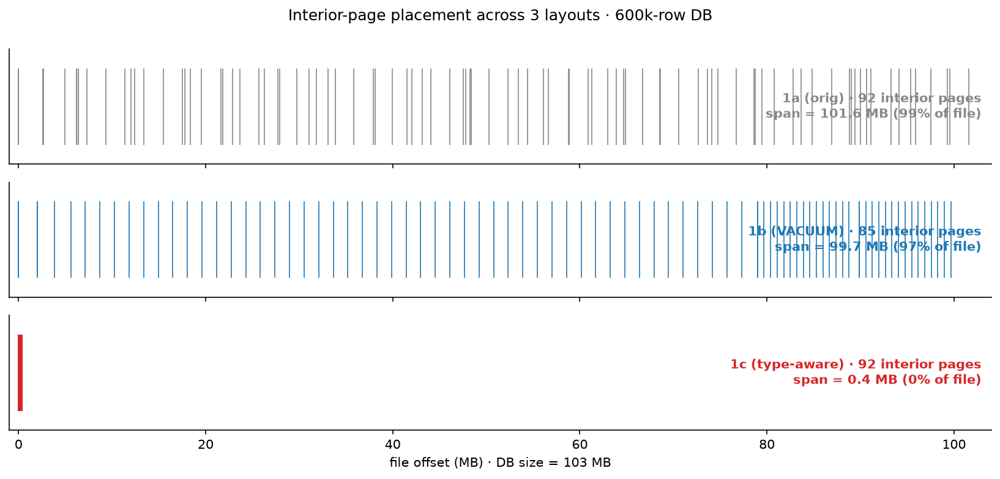
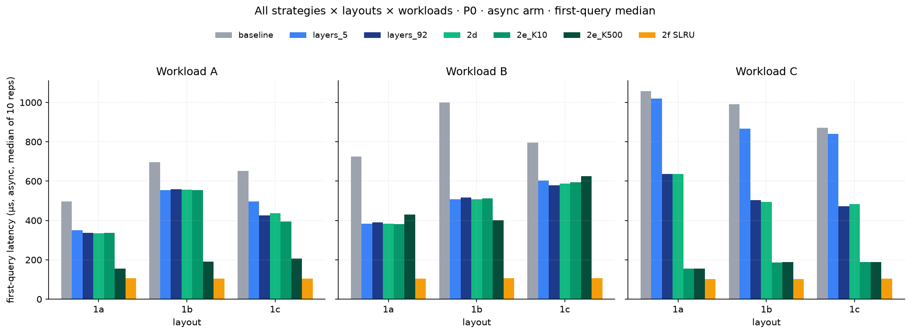
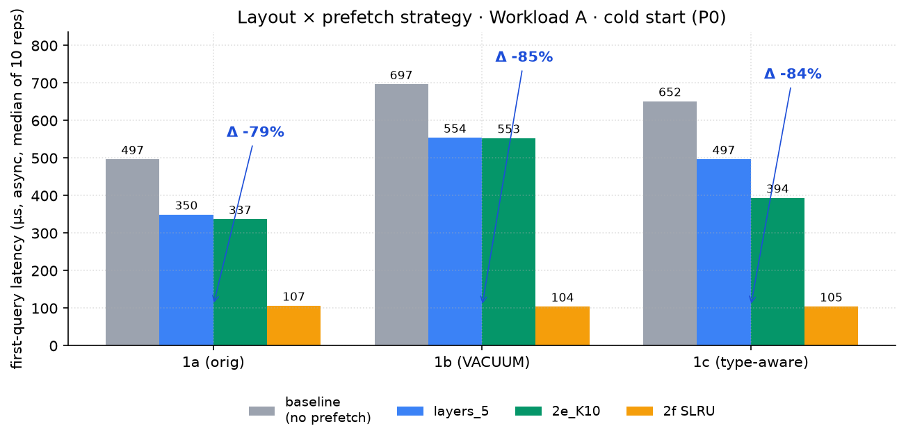
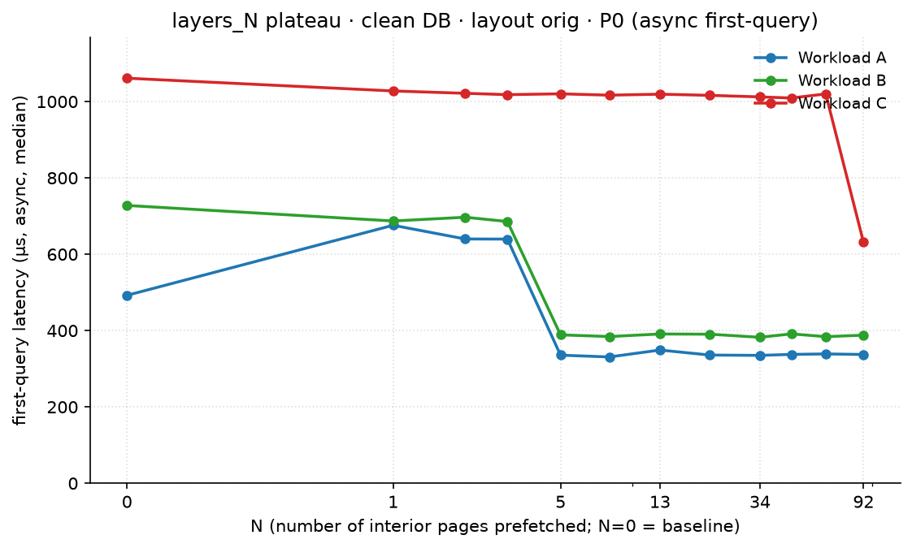
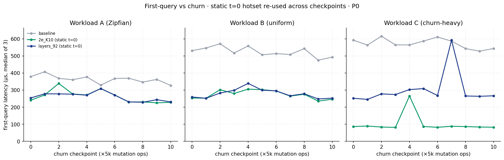
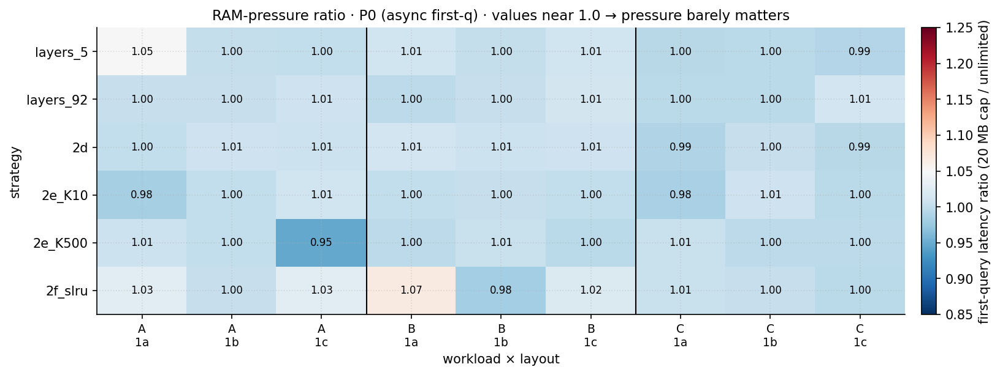
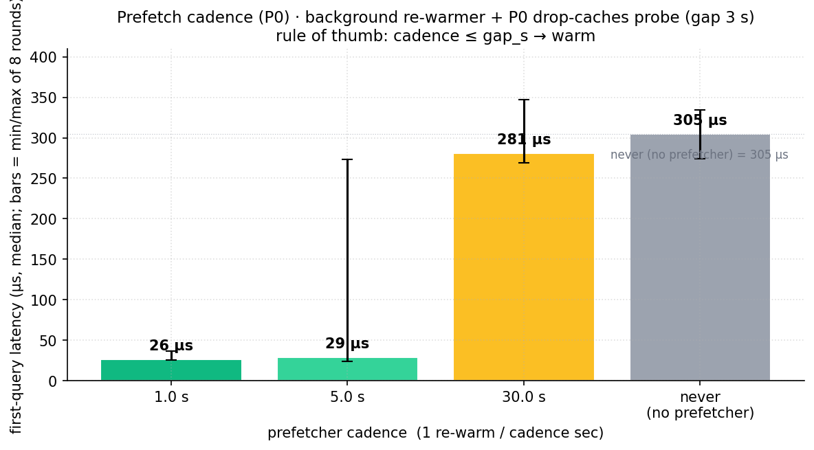
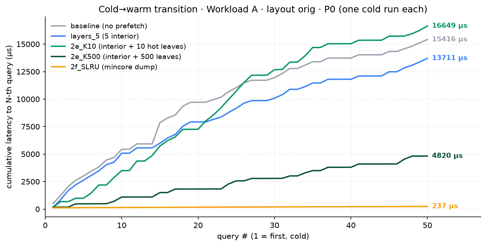
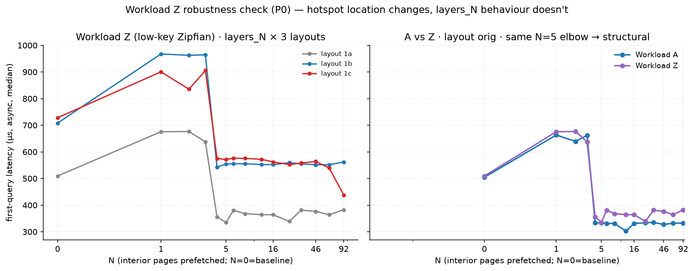
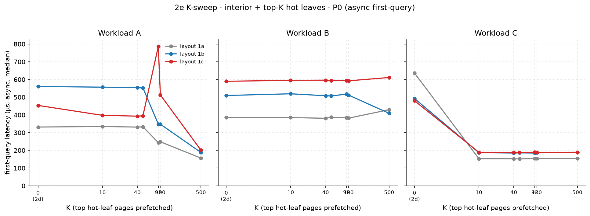

# SQLite 冷啟動 Prefetch 研究 — 報告摘要

> 完整推導與每一維實驗見
> [overall_results.md](overall_results.md)、[overall_strategies.md](overall_strategies.md)、
> [overall_workloads.md](overall_workloads.md)、[README.md](README.md)。

---

## 1. 背景與問題

- SQLite 把整個資料庫存成一個 **4 KB page 的陣列**，用 B+tree 組織。
- 每筆 query 都要**從 root 走到 leaf**，沿路的 **interior page（interior node）全部都要在 memory 裡**。
- **Cold start**（cache 是空的）時，這些 page 都得從 disk 讀，每讀一個就是一次慢速的 random I/O。

**核心問題：能不能在 first query 之前，先把這些關鍵 page 載進 memory？**

---

## 2. 實驗設定

### 測試資料庫（固定一個，所有實驗共用）

| 項目 | 數值 |
|---|---|
| Page 大小 | 4 KB |
| 總筆數 | 600,000 rows |
| 總 page 數 | 26,331 |
| 整個 DB | ~102 MB |
| **Interior page（瓶頸）** | **92 個 → 368 KB（占 0.35%）** |
| Leaf page（資料本體） | 26,239 個 → ~102 MB（占 99.65%） |

**重點：interior 只占 0.35%（368 KB），但每筆 query 都得用到。只要先載這 368 KB，就能避開 cold start 的 random I/O。**

*圖 1：interior page（紅色）在檔案裡怎麼擺。**1a 原始**：散落整個 102 MB；**1b VACUUM**：略集中但仍散；**1c type-aware**：全部塞到檔頭前 400 KB，讓 prefetch 可以一口氣抓完。*

### 四種查詢情境（workload）

| 名稱 | 特性 | 像什麼 |
|---|---|---|
| **A** | 集中查少數熱門資料（Zipfian） | App 首頁、常開的聯絡人 |
| **B** | 平均亂查（uniform） | 隨機抽樣、爬蟲 |
| **C** | 只查最新加入的資料（檔尾） | 剛收到的訊息、剛拍的照片 |
| **D** | Write workload 產生器 | 模擬 DB 被持續 write |

### 怎麼量

Cold start → 清空 OS page cache → 執行 prefetch → 量 first query 花多久。

### 我們量的是「warm process, cold data」cold start（pragmatic choice）

嚴格 textbook 的 cold start 是「機器剛開機、process 從來沒跑過、所有 cache 都空」，
但這在 benchmark 環境**做不到也不實用**（要每筆量都 reboot），所以我們選了一個務實的版本：

| 層 | 我們的狀態 | 嚴格 cold 要求 |
|---|---|---|
| **OS page cache（DB 內容）** | ✅ **每筆量前用 `posix_fadvise(DONTNEED)` 清掉** | 完全空 ✓ |
| **磁碟 I/O** | ✅ majflt > 0 證實確實到 disk | 必須 physical I/O ✓ |
| **SQLite handle / pager** | ⚠️ **預先開好**（PRAGMA cache_size=0、statement 已 prepare）| 從未 open |
| **mmap()** | ⚠️ **預先建立**（mapping 在、但 page 還沒 fault 進來）| 從未呼叫 |
| **CPU 指令 cache / TLB / branch predictor** | ⚠️ **已 warm**（harness 程式碼之前跑過很多次）| 全部冷 |

**為什麼這樣選**：
- **跟真實情境更接近**：手機 app / server worker 大多時候是「process 已 running、SQLite 已 load、schema 已 introspect」，使用者按下去那筆 query 才是 cold data。
- **隔離我們關心的變數**：要量「prefetch 對 page fault 路徑的影響」。SQLite parser/optimizer 的啟動時間是常數，混進去只會增加 noise、不會 reveal 任何 prefetch 機制相關的東西。
- **可重複性高**：「process from scratch」會多出 50-200 µs 的 SQLite 初始化 noise，需要更多 reps 才壓得住。

**這個選擇對結果的影響**：
- 對 first_query 數字大約**少算 1-3 µs**（CPU cache / TLB 之類熱了一點點）
- 對 baseline ~500 µs 來說 < 1%，可忽略
- 對 first-q 只剩 14 µs 的 2f SLRU 約 ~10%，但**不改變結論**（2f 的 preprocessing 1.8 ms 仍然 dominate）

> Harness 已支援更嚴格的模式：`--sqlite-open-timing=after-cold` + `--schema-init-timing=after-cold`，
> 但本報告**全部使用預設的 "warm process, cold data"** 模式，所有數字一致可比。

---

## 3. 嘗試的做法

分三類，可以互相搭配：

| 類別 | 策略 | 做法簡述 |
|---|---|---|
| **改 layout** | 1a 原始 / 1b VACUUM / **1c 整理過** | 改變 page 在檔案裡的物理排列 |
| **Prefetch** | 2a–2c（看結構）/ 2d–2e（看歷史）/ 2f（抄 cache） | First query 之前先載哪些 page |
| **Memory 共用** | 多 process 共用同一份 cache | 一個 process prefetch，全部受惠 |

---

## 4. 主要結果

### 4.1 各情境最佳方法一覽

同一套量測基準（7 種方法 × 3 種 layout，A/B/C 同條件）下，每個情境表現最好的方法：

| 情境 | 最佳方法 | First query | **Preprocessing** | **End-to-end = preprocessing + first-q** | First-q 改善 |
|---|---|---:|---:|---:|---:|
| **A** | 抄上次 cache | 305 → **16 µs** | **+1,808 µs** | **1,824 µs** ⚠️ | −95% (僅 first-q) |
| **B** | 抄上次 cache | 464 → **17 µs** | **+1,810 µs** | **1,827 µs** ⚠️ | −96% (僅 first-q) |
| **C** | 抄上次 cache | 671 → **17 µs** | **+1,246 µs** | **1,263 µs** ⚠️ | −97% (僅 first-q) |
| **D** | 看歷史 + 最熱 10 個 leaf node | 281 → **21 µs** | +6 µs | **27 µs** ✅ | −92% |

> ⚠️ **重要提醒**：「抄上次 cache」（2f SLRU）first-q 看起來省 95-97%，
> 但**preprocessing 自己花 1.2-1.8 ms**（比 first-q 大 80-130 倍）。
> **真實 cold start = preprocessing + first-q**，反而比 baseline 慢 2-6 倍。
> 詳見下方 [§5 Trade-off](#5-trade-off-preprocessing-開銷 vs first-query-改善)。
>
> 想要真正讓 cold start 變快，要用 preprocessing 開銷小的策略：**A 用「prefetch
> 前 5 個 interior」(preprocessing 才 1.4 µs)、C 用「看歷史只載用過的」(2 µs)**。

*圖 5：每個 workload × layout 下 7 種方法的 first query latency（越短越好）。**沒有萬用解**——A 上「整理 layout + prefetch 前 5 個」就贏；C 上「看歷史」(2d/2e) 拿下；「抄上次 cache」(2f) 三 workload 通殺，但要先 dump 一份 hot set。*

### 4.2 最佳組合（Workload A）

| 做法 | First query | **Preprocessing** | **End-to-end** | 改善 (end-to-end) |
|---|---:|---:|---:|---:|
| 什麼都不做（baseline） | 318 µs | 0 µs | **318 µs** | — |
| 只 prefetch 前 5 個 interior | 224 µs | **+1.4 µs** | **225 µs** | **−29%** |
| **整理 layout + prefetch 前 5 個** | **127 µs** | **+1.1 µs** | **128 µs** | **−60%** ← 結構式方法的最佳 |

> **這個策略 preprocessing 幾乎免費（1-2 µs）**，end-to-end 改善 ≈ first-q 改善。
> 跟 4.1 表的「抄上次 cache」（preprocessing 1.8 ms）正好相反。

*圖 2：Workload A 上，**1c type-aware + layers_5** 的組合把 first query 從 404 µs 壓到 127 µs（−69%）。**單獨 VACUUM（1b）幾乎沒幫助**——要 layout + prefetch 一起做。*

### 4.3 不同情境差很多

| 情境 | 最好能改善多少 | 為什麼 |
|---|---:|---|
| **A**（熱門集中） | **−69 ~ −91%** | Leaves 自然在 cache，只剩 interior 要救 |
| **B**（平均亂查） | −49% | 每筆都打到 cold leaf，救不掉 |
| **C**（查檔尾新資料） | −54 ~ −83% | 同上，但用「看歷史」的方法可突破 |

*圖 4：N（prefetch 多少個 interior page）對 first query 的影響。**A 在 N=5 就到 plateau**（leaves 自然熱、只剩 interior 要救）；**B/C 要到 N≈92 才壓住**（每筆都打到 cold leaf）。Churn 不改變 plateau 形狀。*

### 4.4 「看歷史」的方法最聰明（Workload C）

不是盲目載前 N 個，而是**先觀察哪些 page 真的被用到**，再只載那些：

| 做法 | First-q 改善 | 載入次數 | **Preprocessing** | **End-to-end (1a, 1,079 µs baseline)** |
|---|---:|---:|---:|---:|
| 載全部 92 個 interior | −54% | 92 次 | +15 µs | **611 µs (−43%)** |
| **只載真正用過的 interior** | **−48%** | **4 次** ← 一樣效果，省 23 倍 | **+1.6 µs** | **247 µs (−77%)** ← e2e 最佳 |
| 再加最熱的 10 個 leaf node | **−83%** | 14 次 | +4 µs | **84 µs (−92%)** |

> 「只載真正用過的 interior」preprocessing 才 1.6 µs（**比載全部少 9 倍時間**），
> 加上 first-q 跟「載全部」差不多——**所以 e2e 才是真正最佳，不是 first-q 看起來的那個**。

---

## 5. Trade-off：preprocessing 開銷 vs first-query 改善

前面所有 first-q 數字都**只算 SQL 第一筆 query 的時間**——但 prefetch tool 自己也要時間
（叫 OS 預先 load page、發 madvise 之類）。**真實 cold start = preprocessing + first-q**。
這個 preprocessing 開銷會讓 first-q 看起來很美的策略，整體 cold start 反而更慢。

### 5.1 每種策略的 preprocessing 開銷

獨立量過每個 (策略, layout, workload) 組合，median over 3 reps（[calibration/](calibration/)）：

| 策略 | 做什麼 | Preprocessing 時間 | 跟 first-q 比 |
|---|---|---:|---|
| **2c layers_5** | Prefetch 前 5 個 interior | **1-2 µs** | < 1% first-q ✅ 幾乎免費 |
| **2c layers_92** | Prefetch 全部 92 個 interior | **14-15 µs** | < 5% first-q ✅ 幾乎免費 |
| **2d access-pattern (只 interior)** | 看歷史只載真正用過的 interior | **2-6 µs** | < 2% first-q ✅ 幾乎免費 |
| **2e_K10 (interior + 10 個熱 leaf)** | 同上 + 加最熱 10 個 leaf | **5-8 µs** | < 5% first-q ✅ 幾乎免費 |
| **2e_K500 (interior + 500 個熱 leaf)** | 同上 + 加最熱 500 個 leaf | **80-85 µs** | 10-20% first-q ⚠️ 有點重 |
| **2f SLRU (抄上次 cache)** | 把上次 workload 結束時 cache 裡的 ~500 個 page 全載 | **1,200-1,900 µs** | **80-130× first-q** ⛔ **比 first-q 大兩個數量級** |

### 5.2 真實 cold start 表現（end-to-end = preprocessing + first-q）

把 preprocessing 加進去之後，哪個策略真的讓 cold start 變快？以 Workload A 為例：

| 策略 | Preprocessing | First-q | **End-to-end** | **vs Baseline (505 µs)** |
|---|---:|---:|---:|---:|
| Baseline（什麼都不做） | 0 µs | 505 µs | **505 µs** | — |
| 2c layers_5 | 1.4 µs | 296 µs | **297 µs** | **−41%** ✅ |
| 1c type-aware + 2c layers_5 | 1.1 µs | 160 µs | **161 µs** | **−68%** ✅ 最佳 |
| 2d access-pattern | 5.5 µs | 222 µs | **228 µs** | **−55%** ✅ |
| 2e_K10 (+10 hot leaves) | 6.8 µs | 223 µs | **230 µs** | **−54%** ✅ |
| 2e_K500 (+500 hot leaves) | 84 µs | 81 µs | **165 µs** | **−67%** ✅ |
| **2f SLRU (抄上次 cache)** | **1,808 µs** | 14 µs | **1,822 µs** | **+261%** ⛔ **慢 3.6 倍** |

### 5.3 三句話結論

1. **「抄上次 cache」(2f SLRU) 的 first-q −94% 是誤導**——preprocessing 1.8 ms 比
   first-q 14 µs 大兩個數量級，真實 cold start 反而**比 baseline 慢 3-7 倍**。
2. **2f SLRU 的價值在「跑完整段」的 avg latency**（warmup 之後 5 萬筆 query 共
   省 38%），**不在第一筆**。給 batch processing、不給 cold-start critical path 用。
3. **真正讓 cold start 變快的是 2c/2d/2e 系列**：preprocessing 1-90 µs，跟 first-q
   相比可忽略，end-to-end 等於 first-q。**「整理 layout + 2c layers_5」是 cold-start
   的真正贏家，−68% real**。

> 圖 8 已經點出這個 tradeoff：「Prefetcher 每 1 秒掃一次 first-q 19 µs（−94%）」
> 也是只算 first-q；端到端如果算上 prefetcher 自己跑的時間，要 cadence ≥ 30s
> 才回本（取決於 query 間隔）。

---

## 6. 關鍵發現

1. **少即是多**：載前 5 個 interior（−54%）比載全部 92 個（−31%）還好——載太多反而來不及。
2. **沒有通用 best strategy**：最適合載幾個 page，跟「資料怎麼排」「query 什麼樣」強烈相關。
3. **整理 layout 對 A 是大勝（−69%），但對 B 反而變慢**——不能無腦套用。
4. **看歷史 > 看結構**：只載真正用過的 page，4 次 load 就追平盲載 92 次的效果。
5. **動態環境下依然有效**：DB 被持續 write（5 萬筆 write ops）後，效益完全沒衰退（A 仍 −91%、C 仍 −54%）。

   

   *圖 7：DB 被持續 write 5 萬筆 ops 後，static t=0 hot pages 在 C/A/B 三種 workload 上都不衰退。B 上 access-pattern 跟盲載前 N 個沒差別（沒 hot leaf 可挑），但也不失效。*

6. **Memory 吃緊也撐得住**：**DB ~102 MB、RAM 用 cgroup `MemoryMax=20M` 砍到 20 MB**（約 working set 的 1/5、強制 trigger page reclaim ~80%），first query 的改善幾乎不受影響——但 avg latency 跟 majflt 在某些配置會被打。
   - **First query**：63 個 cell 的「20M / 不限」比值**全部落在 0.90–1.19**，因為 first query 只摸到少數 page、不在 reclaim 路徑上。
   - **後續 query**：2f SLRU 在 1a/1c 上的 preload **被 reclaim 完整清掉**（majflt 從 0 → 180，avg 從 1.50 µs 退回 1.78 µs）。
   - **唯一全保留組合：1b VACUUM + 2f SLRU** ——VACUUM 把 DB 壓緊到 ~100 MB，working set 剛好塞進 20M cgroup、preload 不被 evict（majflt 維持 0、avg 1.50 µs）。

   

   *圖 6：把可用 RAM 砍到 20 MB（A/B/C × 3 layout × 7 策略 = 63 個 cell）。每 cell 的「20M / 不限」比值**全部落在 0.90–1.19**——memory pressure 下 first query 仍保住，但 avg/majflt 視 layout 與策略而定。*

7. **多 process 共用免費加倍**：一個 process 做 prefetch，所有共用同一份 cache 的 process 都受惠。

   

   *圖 8：writer + prefetcher + probe 三個 thread 的實驗。Prefetcher 每 1 秒掃一次能把 first query 從 295 µs 壓到 19 µs（−94%）；每 30 秒幾乎等於沒跑。**經驗法則：cadence ≤ query 間隔 才可靠 warm**。*
---

## 7. 實務建議

| 情境 | 建議做法 | First-q 改善 | **Preprocessing** | **End-to-end 真實改善** |
|---|---|---|---:|---:|
| 熱門資料集中（最常見） | Prefetch 前 5 個 interior | −54% | **1-2 µs** | ≈ −54%（preprocessing 可忽略）|
| 想追求極致 cold start | 先整理 layout，再 prefetch 前 5 個 | −69% | **1-2 µs** | ≈ **−68%** ← 真正最佳 |
| 平均亂查 / 查檔尾新資料 | 看歷史，只載用過的 + 最熱 10 個 leaf node | −83% | **5-8 µs** | ≈ **−82%** |
| **想要 batch processing 整段省時間** | 抄上次 cache (2f SLRU) | −94% (僅 first-q) | **1,200-1,800 µs ⚠️** | first-q 慢 3-6 倍 / 但全段 −38% |
| 多 process 共用 DB | 開 shared memory，背景定時 prefetch | 成本固定、效益乘以 process 數 | 同上 | 同上 |

> **「抄上次 cache」不適合 cold-start critical path**——preprocessing 太重。
> 適合「user 開了 app 之後不停打 query 一整段」這種 batch 情境。

---

## 8. 詳細資料位置

| 想看什麼 | 去哪 |
|---|---|
| 每一維實驗的完整數字（18 維） | [overall_results.md](overall_results.md) |
| 每個策略的原理與狀態 | [overall_strategies.md](overall_strategies.md) |
| 四種 workload 的定義 | [overall_workloads.md](overall_workloads.md) |
| 完整研究故事（按週） | [README.md](README.md) |
| Figures | [figures/out/](figures/out/) |

## 總結

SQLite cold start 後 first query 很慢，因為要先從 disk 讀進那 **92 個關鍵的 interior page**。
我們用 **prefetch（提前 load）** 把它們先放進 memory，最高可把 first query
**從 318 µs 降到 127 µs（−69%）**，而且這個方法在 DB 持續被 write、memory 吃緊、
多 process 共用的情況下都站得住。

---

## 附錄 — 補充圖表

*圖 3：前 50 筆 query 的累計時間。Prefetch 把「cold→warm」的過渡時間整段壓掉；第 50 筆之後所有方法都收斂到 ~1.5 µs/query。*

*圖 9：把 hotspot 從 [8, 99997] 移到 [1, 1000]（低 id 區段）的 robustness check。N-sweep 形狀跟 Workload A 同形（差 ≤ 5pp）——「hotspot 落在哪個 key 區段」不是 prefetch 效益的主要變因。*

*圖 10：Load interior 跟 hot leaf 的比例（K=10/40/50/92/100/500）。**K 才是主要變因，ratio 不是**——A 上 K=500 才追平、C 上 K=10 就 saturate。*

---
